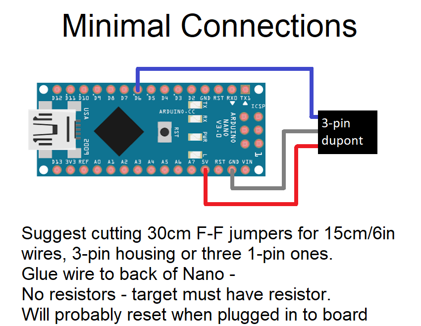
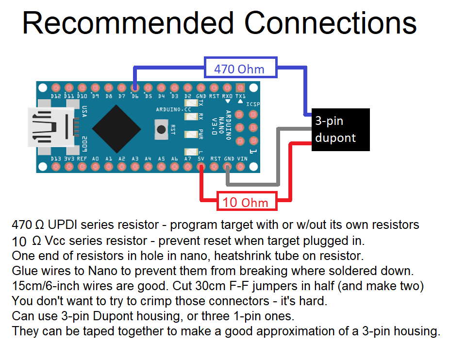
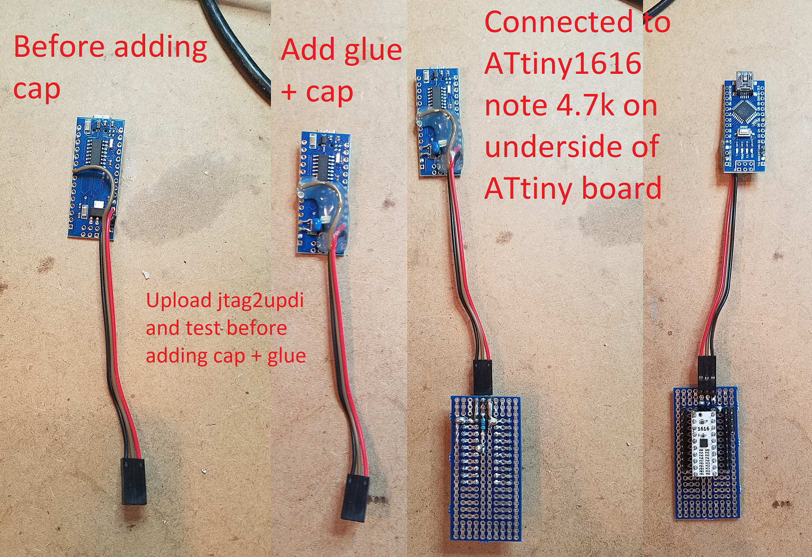

# Step-by-step guide to turn a uno/nano/pro mini into a UPDI programmer

The ATtiny 0- and 1-series are programmed through the Unified Program and Debug Interface (UPDI). This is a 1-wire interface using the reset pin on the ATtiny. The ATtiny does not have a bootloader, so a UPDI programmer is required to upload the sketches. The classic ISP programmers cannot be used - only UPDI can be used to program these parts.

An Arduino sketch is available to turn ATmega328(p)-based Arduino’s, like the Arduino UNO and Nano, into an UPDI programmer (it does not work on boards based on other parts, like the 32u4 (Micro/Leo) or any non-AVR board). The following steps show how to make one of these low cost UPDI programmers. We recommend using an Arduino Nano or Pro Mini (a cheap clone from ebay is fine) and hard-wiring it for the task.

## Part 1: Upload the sketch to your Arduino
1. The UPDI programmer sketch can be found here: https://github.com/SpenceKonde/jtag2updi
Download and extract, or clone the repo to your local machine.
2. Browse to the download location and open the jtag2updi folder
3. Open the sketch jtag2updi.ino and upload it to your Arduino. The .ino file itself is empty, and this is fine - all the code is contained in other files in the same folder, but the empty .ino is needed so that the IDE can compile it.

## Part 2: Connect hardware
*previous versions of this guide specified a cap between reset and ground after programming. Testing has revealed this to be unnecessary*
1. Connect Ground of Arduino to Ground of the ATTiny
2. Connect Pin 6 of the Arduino to the UPDI pin of the ATTiny - if using the bare chip, connect it via a [470 ohm resistor](https://github.com/SpenceKonde/AVR-Best-Practices/blob/master/HardwareNotes/UPDISeriesResistors.md). Many breakout boards will provide a separate UPDI pin that has this resistor built-in; in this case, this pin may be connected directly to the programming pin.
3. Unless the ATtiny has it's own power supply, connect 5v pin of the Arduino to the Vcc pin of the ATtiny

Now, you should be able to select an ATtiny megaAVR series board from Tools -> Board, and upload a sketch via the IDE. The same programmer can also be used to Burn Bootloader (be sure to select the jtag2updi (megaTinyCore) programmer from Tools -> Programmer menu)

**If the process appears to hang at the start of the upload, press and release the reset button on the UPDI prpgrammer** I pounded on jtag2updi for like a month trying to get rid of all the bugs like this, and after finally getting my fixes merged in, discovered that somehow, this could still happen.

### Ignore the warning about "flash" and "boot" memories
A warning will be shown during the upload process `avrdude: jtagmkII_initialize(): Cannot locate "flash" and "boot" memories in description` - this warning is spurious and can be safely ignored.

## Permanent programmer assembly suggestions:
* For convenience, we recommend dedicating a Nano or Pro Mini to this purpose, and soldering the connections. Nano and Pro Mini clones can be had on ebay for $2-5 shipped. Use one without the headers pre-installed.
* Solder the wires in place - we suggest using 0.1" DuPont jumpers: Cut the jumpers in half, strip, and solder in place.
* After soldering the wires in place, glue them to the bottom of the board with hot-melt glue, otherwise they will fatigue and break easily with handling.
* We suggest arranging the connectors in the following order: UPDI, GND, Vcc - this way, if you attach the connector backwards, no harm is done. Use a 3-pin DuPont housing, or hold three 1-pin housings in together with scotch tape.

## Prevent USB glitch when connecting board
If you've been using Arduino and assorted microcontroller development boards for a while, you have probably noticed the tendency for USB serial adapters, Nanos-as-programmers and similar to briefly disconnect and reconnect when a board is connected an adapter that is already connected to the computer. This is caused by the "inrush"  current. As the capacitors on the programmer, at 5v are connected to those on the (unpowered) target at 0v the voltages on them equalize faster than current can flow in to charge them back up. This This causes the USB device that was already connected to experience a brief "brownout" that causes it to reset. The result is that the device disconnects, and then a few seconds later after it restarts, it will reconnect to the computer and reappear. Depending on specifics of the device and conditions, it may or may not reset cleanly. That can sometimes be rectified by pressing the reset button - but when programming many boards consecutively, this can seriously impact your productivity, as you may have to reset the programmer for each device you are programming!

Luckily, there is a very simple solution to this: Place a very low value resistor in series with the Vcc line between the programmer and target. 10 ohms works well for this, though for a very minimalist target board, though values from 4.7 to 22 Ohms worked in my tests. I recommend 10 as that gives some margin for worse conditions, without making the voltage droop enough for me to be concerned. This limits the inrush current enough to prevent it from resetting the controller. While one might be inclined to try to deal with this by adding bulk decoupling capacitors to the programmer, the USB specification stipulates that capacitance of a USB device should not exceed 10uF due to this same inrush current phenomenon - and a large amount of added decoupling may be necessary. Most microcontroller breakout boards - and most programmers - are already close to that limit.

Note: The resistor method of dealing with inrush current requires that nothing which draws much current be connected to the target during programming. 50mA is a sensible upper limit - with 10 ohms of resistance, that gives you 4.5v, so all speeds are still in spec and you're safely clear of the highest BOD trigger voltage. A way around this current limit, without dealing with the resets is to *not* connect the Vcc line at all, and instead provide power from an external 5v supply (USB phone chargers paired with micro-USB breakout boards (or even chopped up USB cables) are an expedient solution. Micro USB breakout boards are available cheaply from ebay/aliexpress, and almost everyone has USB cables kicking around...

## Troubleshooting

### Ignore the warning about "flash" and "boot" memories
A warning will be shown during the upload process `avrdude: jtagmkII_initialize(): Cannot locate "flash" and "boot" memories in description` - this warning is spurious (a bug in avrdude, or in the modifications made to support jtag2updi). It can and should be ignored - it is shown whenever uploading via jtag2updi

### Use Verbose uploads
The avrdude output is very terse by default, particularly with AVRdude

## Photographs

### Nano as UPDI programmer, assembly and use
 "Nano converted to UPDI programmer")

### Pro Mini (and serial adapter) as UPDI
(megaavr/extras/ProMiniAsUPDI.png["Pro Mini converted to UPDI programmer")
### Typical development configuration
Since it is frequently useful to have a serial port for debugging, I typically find myself using a configuration like this, with a serial adapter and UPDI programmer connected simultaneously. Obviously, one could also use Optiboot, but without disabling UPDI to get reset, or using other awkward tricks (see [AlternativeReset. So

