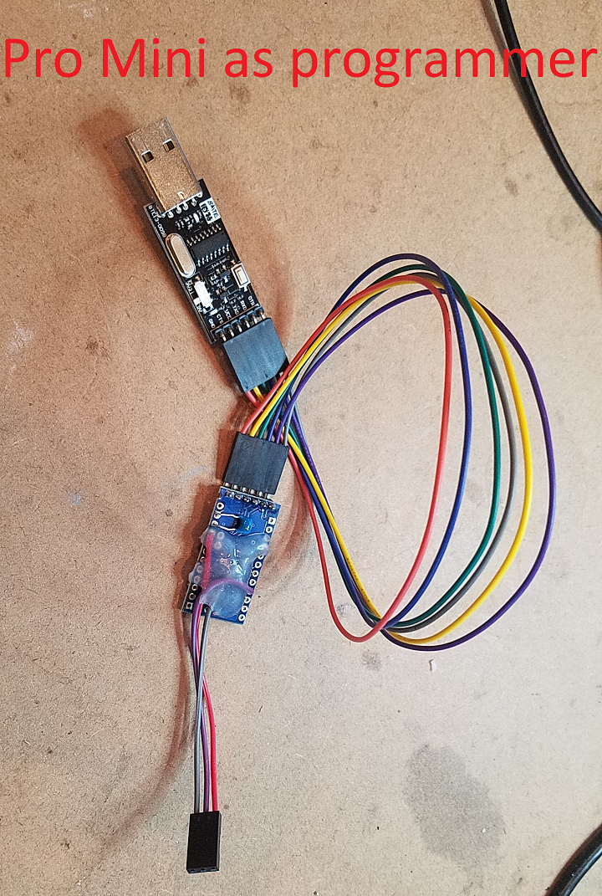

# Step-by-step guide to turn a uno/nano/pro mini into a UPDI programmer

The ATtiny 0- and 1-series are programmed through the Unified Program and Debug Interface (UPDI). This is a 1-wire interface using the reset pin on the ATtiny. The ATtiny does not have a bootloader, so a UPDI programmer is required to upload the sketches. The classic ISP programmers cannot be used - only UPDI can be used to program these parts. 

An Arduino sketch is available to turn ATmega328(p)-based Arduino’s, like the Arduino UNO and Nano, into an UPDI programmer (it does not work on boards based on other parts, like the 32u4 (Micro/Leo) or any non-AVR board). The following steps show how to make one of these low cost UPDI programmers. We recommend using an Arduino Nano or Pro Mini (a cheap clone from ebay is fine) and hard-wiring it for the task.

## Part 1: Upload the sketch to your Arduino
1.	The UPDI programmer sketch can be found here: https://github.com/SpenceKonde/jtag2updi
Download and extract, or clone the repo to your local machine. 
2.	Browse to the download location and open the jtag2updi folder
3.	Open the sketch jtag2updi.ino and upload it to your Arduino. The .ino file itself is empty, and this is fine - all the code is contained in other files in the same folder, but the empty .ino is needed so that the IDE can compile it. 

## Part 2: Connect hardware
1.  Connect a 10uF capacitor (if you don't have a 10uF one, any value higher than 4.7uF is fine) between reset and ground on the Arduino (this must be removed before you upload a different sketch to the Arduino). 
2.  Connect Ground of Arduino to Ground of the ATTiny
3.  Connect Pin 6 of the Arduino to the UPDI pin of the ATTiny - if using the bare chip, connect it via a 4.7k resistor. Many breakout boards will provide a separate UPDI pin that has this resistor built-in; in this case, pin 6 should be connected directly to this programming pin. 
4.	Unless the ATtiny has it's own power supply, connect 5v pin of the Arduino to the Vcc pin of the ATtiny

Now, you should be able to select an ATtiny megaAVR series board from Tools -> Board, and upload a sketch via the IDE. The same programmer can also be used to Burn Bootloader (be sure to select the jtag2updi (megaTinyCore) programmer from Tools -> Programmer menu) 

### Ignore the warning about "flash" and "boot" memories 
A warning will be shown during the upload process `avrdude: jtagmkII_initialize(): Cannot locate "flash" and "boot" memories in description` - this warning is spurious and can be safely ignored. 

## Permanent programmer assembly suggestions: 
* For convenience, we recommend dedicating a Nano or Pro Mini to this purpose, and soldering the connections. Nano and Pro Mini clones can be had on ebay for under $3 including shipping. Use one without the headers pre-installed. 
* Solder the 10uF cap in place after uploading the sketch. A small ceramic cap can be bent across the bottom of the board. 
* Solder the wires in place - we suggest using 0.1" DuPont jumpers: Cut the jumpers in half, strip, and solder in place.
* After soldering the wires in place, glue them to the bottom of the board with hot-melt glue, otherwise they will fatigue and break easily with handling.
* We suggest arranging the connectors in the following order: UPDI, GND, Vcc - this way, if you attach the connector backwards, no harm is done. Use a 3-pin DuPont housing, or hold the three 1-pin housings in together with scotch tape. In July 2019, I expect to have breakout boards available for all of the supported families of parts from my Tindie store, these will provide a programming header with the pins in this order, with the 4.7k resistor on-board (so no resistor should be included on the programmer). 
## Nano as UPDI programmer, assembly and use
 "Nano converted to UPDI programmer")

## Pro Mini (and serial adapter) as UPDI

## Typical development configuration
Since it is frequently useful to have a serial port for debugging, I typically find myself using a configuration like this, with a serial adapter and UPDI programmer connected simultaneously.

