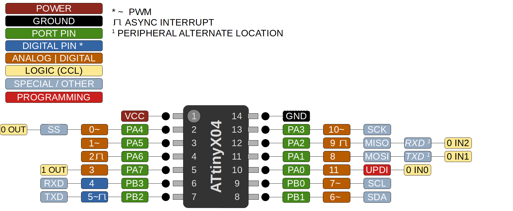

### ATtiny 204/404/804/1604

 Specifications |  ATtiny204|  ATtiny404  |  ATtiny804  |    ATtiny1604   
------------ | ------------- | ------------- | ------------- | ------------- 
Flash (program memory)   | 2048 bytes | 4096 bytes | 8192 bytes | 16384 bytes 
RAM  | 128 bytes | 256 bytes | 512 bytes | 1024 bytes  
EEPROM | 64 bytes | 128 bytes | 128 bytes | 256 bytes 
Bootloader | No | No | No | No 
GPIO Pins | 12 | 12 | 12 | 12 
ADC Channels | 10 | 10 | 10 | 10 
PWM Channels | 6 | 6 | 6 | 6 
Timer Type B| 1 | 1 | 1 | 1 
DAC | No | No | No | No
Interfaces | UART, SPI, I2C | UART, SPI, I2C | UART, SPI, I2C | UART, SPI, I2C 
Clock options | Internal 16/20mhz | Internal 16/20mhz | Internal 16/20mhz | Internal 16/20mhz 

### Datasheets
[ATtiny204/404](http://ww1.microchip.com/downloads/en/devicedoc/50002687a.pdf)

[ATtiny804/1604](http://ww1.microchip.com/downloads/en/DeviceDoc/ATtiny804_1604-Data-Sheet-40002028A.pdf)
