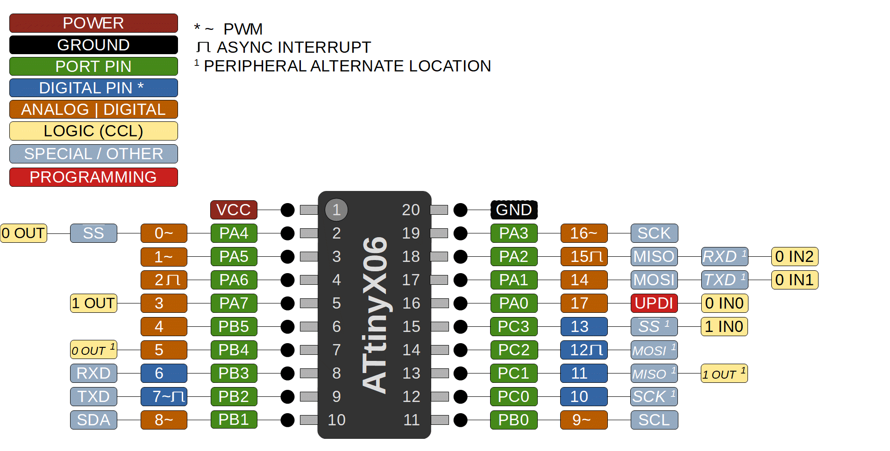

### ATtiny 406/806/1606

 Specifications |  ATtiny406  |  ATtiny806  |    ATtiny1606
------------ | ------------- | ------------- | -------------
Flash (program memory)   | 4096 bytes| 8192 bytes | 16384 bytes
Flash w/Optiboot   | 3584 bytes| 7680 bytes | 15872 bytes
RAM  | 256 bytes | 512 bytes | 1024 bytes
EEPROM | 128 bytes | 128 bytes | 256 bytes
Bootloader | Optiboot (optional, not recommended) | Optiboot (optional)| Optiboot (optional)
GPIO Pins | 18 (17 usable) | 18 (17 usable) | 18 (17 usable)
ADC Channels | 12 (11 usable) | 12 (11 usable) | 12 (11 usable)
DAC | No | No | No
PWM Channels | 6 | 6 | 6
Timer Type B | 1 | 1 | 1
Timer Type D | No | No | No
Interfaces | UART, SPI, I2C | UART, SPI, I2C | UART, SPI, I2C
Clock options | Internal 20/16/10/8/5/4/1 MHz | Internal 20/16/10/8/5/4/1 MHz | Internal 20/16/10/8/5/4/1 MHz

### Buy official megaTinyCore breakouts and support continued development!
[ATtiny1606 assembled](https://www.tindie.com/products/17597/)
[ATtiny3216/1616/816/416/1606/806/406 bare board](https://www.tindie.com/products/17614/)

### Datasheets and Errata
See [Datasheet Listing](Datasheets.md)
