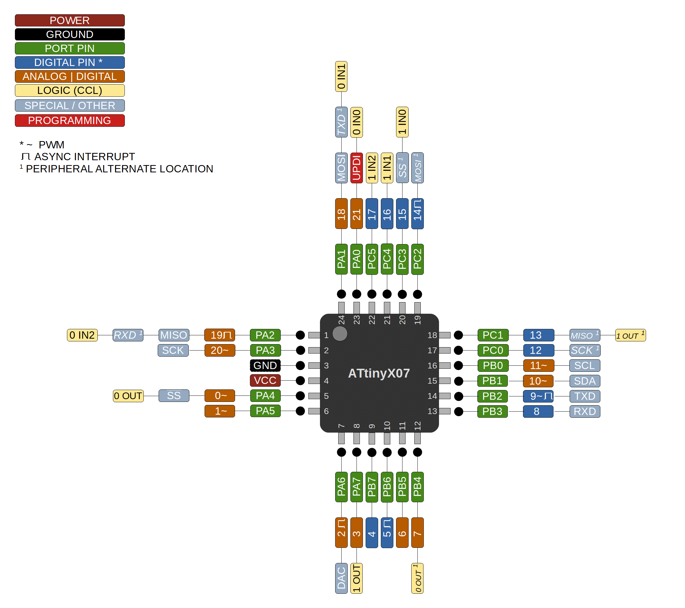

### ATtiny 807/1607

 Specifications |    ATtiny807  |    ATtiny1607   
------------ | ------------- | -------------
Flash (program memory)   |  8192 bytes | 16384 bytes 
RAM   | 512 bytes | 1024 bytes 
EEPROM | 128 bytes | 256 bytes 
Bootloader | No | No 
GPIO Pins | 22 (21 usable) | 22 (21 usable)
ADC Channels | 12 (11 usable) | 12 (11 usable)
DAC | No | No 
PWM Channels | 6 | 6 
Timer Type B | 1 | 1 
Interfaces | UART, SPI, I2C | UART, SPI, I2C 
Clock options | Internal 16/20mhz | Internal 16/20mhz 

### Datasheets
[ATtiny807/1607](http://ww1.microchip.com/downloads/en/DeviceDoc/ATtiny807_1607-Data-Sheet-40002030A.pdf)
