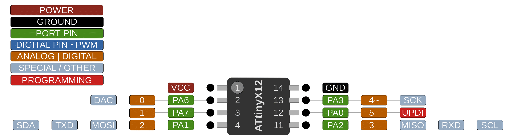

### ATtiny 212/412

 Specifications |  ATtiny212|  ATtiny412   
------------ | ------------- | -------------
Flash (program memory)   | 2048 bytes | 4096 bytes
RAM  | 128 bytes | 256 bytes  
EEPROM | 64 bytes | 128 bytes 
Bootloader | No | No 
GPIO Pins | 6 | 6 
ADC Channels | 6 | 6 
PWM Channels | 1 | 1 
Timer Type B | 1 | 1
DAC | Yes | Yes 
Interfaces | UART, SPI, I2C | UART, SPI, I2C
Clock options | Internal 16/20mhz | Internal 16/20mhz

### Datasheets
[ATtiny212/412](http://ww1.microchip.com/downloads/en/DeviceDoc/40001911A.pdf)
