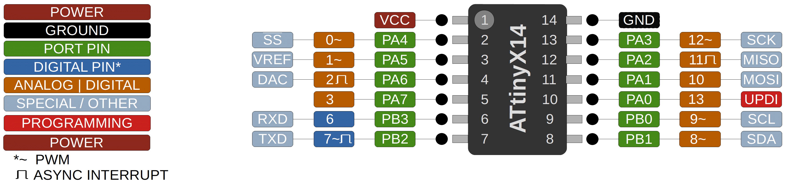

### ATtiny 214/414/814/1614

 Specifications |  ATtiny214|  ATtiny414  |  ATtiny814  |    ATtiny1614   
------------ | ------------- | ------------- | ------------- | ------------- 
Flash (program memory)   | 2048 bytes | 4096 bytes | 8192 bytes | 16384 bytes 
Flash w/Optiboot   | 1536 bytes | 3584 bytes | 7680 bytes | 15872 bytes 
RAM  | 128 bytes | 256 bytes | 512 bytes | 2048 bytes  
EEPROM | 64 bytes | 128 bytes | 128 bytes | 256 bytes 
Bootloader | No | No | No | No 
GPIO Pins | 12 (11 usable) | 12 (11 usable) | 12 (11 usable) | 12 (11 usable)
ADC Channels | 10 (9 usable) | 10 (9 usable) | 10 (9 usable) | 10 (9 usable)
PWM Channels | 6 | 6 | 6 | 6 
Timer Type B | 1 | 1 | 1 | 2 
DAC | Yes | Yes | Yes | Yes
Interfaces | UART, SPI, I2C | UART, SPI, I2C | UART, SPI, I2C | UART, SPI, I2C 
Clock options | Internal 16/20mhz | Internal 16/20mhz | Internal 16/20mhz | Internal 16/20mhz 

### Buy official megaTinyCore breakouts and support continued development!
[ATtiny1614 assembled](https://www.tindie.com/products/17598/)

[ATtiny1614/814/414/1604/804/404 bare board](https://www.tindie.com/products/17748/)

### Datasheets
[ATtiny1614](http://ww1.microchip.com/downloads/en/DeviceDoc/ATtiny1614-data-sheet-40001995A.pdf)

[ATtiny214/414/814](http://ww1.microchip.com/downloads/en/DeviceDoc/40001912A.pdf)
