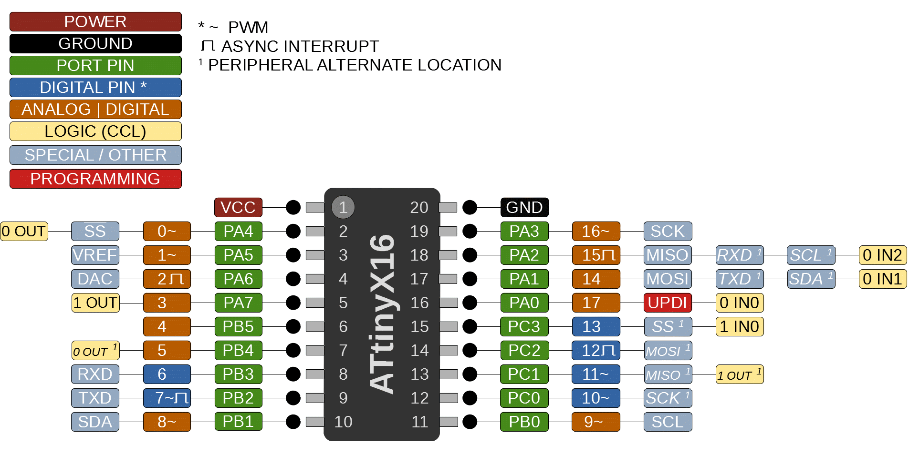

### ATtiny 416/816/1616/3216

 Specifications |  ATtiny416  |  ATtiny816  |    ATtiny1616   |   ATtiny3216
------------ | ------------- | ------------- | ------------- | -------------
Flash (program memory)   | 4096 bytes| 8192 bytes | 16384 bytes | 32768 bytes
RAM  | 256 bytes | 512 bytes | 2048 bytes | 2048 bytes
EEPROM | 128 bytes | 128 bytes | 256 bytes | 256 bytes
Bootloader | Optiboot (optional, not recommended) | Optiboot (optional)| Optiboot (optional) | Optiboot (optional)
GPIO Pins | 18 (17 usable) | 18 (17 usable) | 18 (17 usable) | 18 (17 usable)
ADC Channels | 12 (11 usable) | 12 (11 usable) | 12 (11 usable) | 12 (11 usable)
DAC | Yes | Yes | Yes | Yes
PWM Channels | 8 | 8 | 8 | 8
Timer type B | 1 | 1 | 2 | 2
Timer Type D | Yes | Yes | Yes | Yes
Interfaces | UART, SPI, I2C | UART, SPI, I2C | UART, SPI, I2C | UART, SPI, I2C
Clock options | Internal 20/16/10/8/5/4/1 MHz | Internal 20/16/10/8/5/4/1 MHz | Internal 20/16/10/8/5/4/1 MHz | Internal 20/16/10/8/5/4/1 MHz

### Buy official megaTinyCore breakouts and support continued development!
[ATtiny3216 assembled](https://www.tindie.com/products/17597/)

[ATtiny3216/1616/816/416/1606/806/406 bare board](https://www.tindie.com/products/17614/)

### Datasheets and Errata
See [Datasheet Listing](Datasheets.md)
