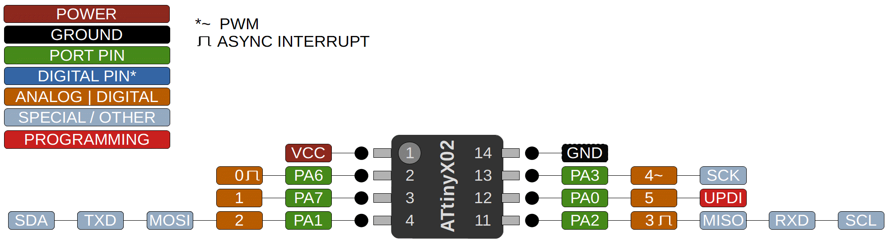

### ATtiny 202/402

 Specifications |  ATtiny202|  ATtiny402   
------------ | ------------- | -------------
Flash (program memory)   | 2048 bytes | 4096 bytes
Flash w/Optiboot  | 1536 bytes | 3584 bytes
RAM  | 128 bytes | 256 bytes  
EEPROM | 64 bytes | 128 bytes 
Bootloader | No | No 
GPIO Pins | 6 (5 usable) | 6 (5 usable)
ADC Channels | 6 (5 usable) | 6 (5 usable)
PWM Channels | 4 | 4 
Timer Type B | 1 | 1 
DAC | No | No 
Interfaces | UART, SPI, I2C | UART, SPI, I2C
Clock options | Internal 16/20mhz | Internal 16/20mhz

### Signature Issue
There exist ATtiny402's in the wild where the last byte of the signature is 0x25, instead of 0x27. Currently shipping parts from Atmel/Microchip have the correct signature. If you are stuck with parts with the wrong signature, choose ATtiny402 (bad signature) from the tools -> chip menu. 

### Buy official megaTinyCore breakouts and support continued development!
[ATtiny402 assembled](https://www.tindie.com/products/17685/)
[ATtiny412/212/402/202 bare board](https://www.tindie.com/products/17749/)

### Datasheets
[ATtiny202/402](http://ww1.microchip.com/downloads/en/DeviceDoc/ATtiny202-402-DataSheet-DS40001969B.pdf)
