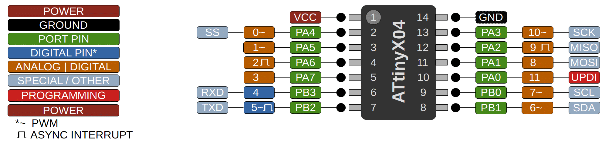

### ATtiny 204/404/804/1604

 Specifications |  ATtiny204|  ATtiny404  |  ATtiny804  |    ATtiny1604
------------ | ------------- | ------------- | ------------- | -------------
Flash (program memory)   | 2048 bytes | 4096 bytes | 8192 bytes | 16384 bytes
Flash w/Optiboot   | 1536 bytes | 3584 bytes | 7680 bytes | 15872 bytes
RAM  | 128 bytes | 256 bytes | 512 bytes | 1024 bytes
EEPROM | 64 bytes | 128 bytes | 128 bytes | 256 bytes
Bootloader | Optiboot (optional, not recommended) | Optiboot (optional, not recommended)\ Optiboot (optional) | Optiboot (optional)
GPIO Pins | 12 (11 usable) | 12 (11 usable) | 12 (11 usable) | 12 (11 usable)
ADC Channels | 10 (9 usable) | 10 (9 usable) | 10 (9 usable) | 10 (9 usable)
DAC | No | No | No | No
PWM Channels | 6 | 6 | 6 | 6
Timer Type B| 1 | 1 | 1 | 1
Timer Type D | No | No | No | No
Interfaces | UART, SPI, I2C | UART, SPI, I2C | UART, SPI, I2C | UART, SPI, I2C
Clock options | Internal 20/16/10/8/5/4/1 MHz | Internal 20/16/10/8/5/4/1 MHz | Internal 20/16/10/8/5/4/1 MHz | Internal 20/16/10/8/5/4/1 MHz

### Buy official megaTinyCore breakouts and support continued development!
[ATtiny1604 assembled](https://www.tindie.com/products/17598/)

[ATtiny1614/814/414/1604/804/404 bare board](https://www.tindie.com/products/17748/)

### Datasheets
[ATtiny204/404](http://ww1.microchip.com/downloads/en/DeviceDoc/ATtiny204-404-DataSheet-DS50002687B.pdf)

[ATtiny804/1604](http://ww1.microchip.com/downloads/en/DeviceDoc/ATtiny804_1604-Data-Sheet-40002028A.pdf)
