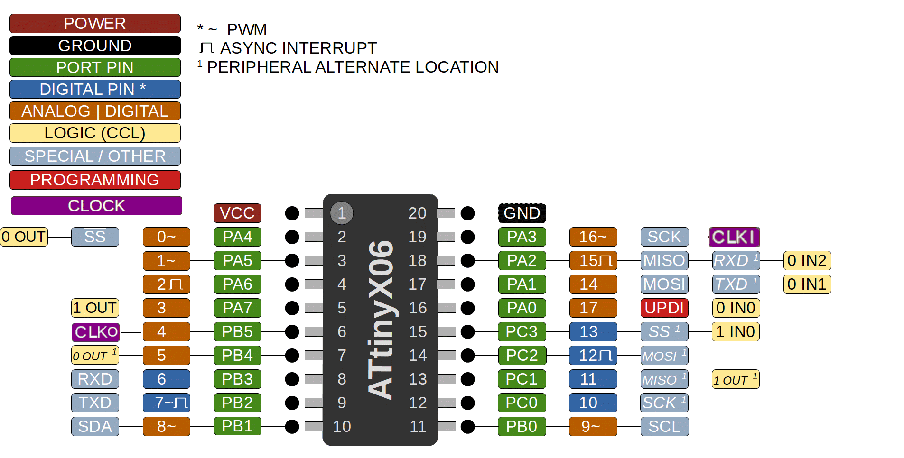

### ATtiny 406/806/1606

 Specifications |  ATtiny406  |  ATtiny806  |    ATtiny1606   
------------ | ------------- | ------------- | ------------- 
Flash (program memory)   | 4096 bytes| 8192 bytes | 16384 bytes 
Flash w/Optiboot   | 3584 bytes| 7680 bytes | 15872 bytes 
RAM  | 256 bytes | 512 bytes | 1024 bytes 
EEPROM | 128 bytes | 128 bytes | 256 bytes 
Bootloader | No | No | No 
GPIO Pins | 18 (17 usable) | 18 (17 usable) | 18 (17 usable)
ADC Channels | 12 (11 usable) | 12 (11 usable) | 12 (11 usable)
DAC | No | No | No 
PWM Channels | 6 | 6 | 6 
Timer Type B | 1 | 1 | 1
Interfaces | UART, SPI, I2C | UART, SPI, I2C | UART, SPI, I2C
Clock options | Internal 16/20mhz | Internal 16/20mhz | Internal 16/20mhz 

### Datasheets
[ATtiny406](http://ww1.microchip.com/downloads/en/DeviceDoc/ATtiny406-DataSheet-DS40001976B.pdf)
[ATtiny806/1606](http://ww1.microchip.com/downloads/en/DeviceDoc/ATtiny806-1606-DataSheet-DS40002029B.pdf)
