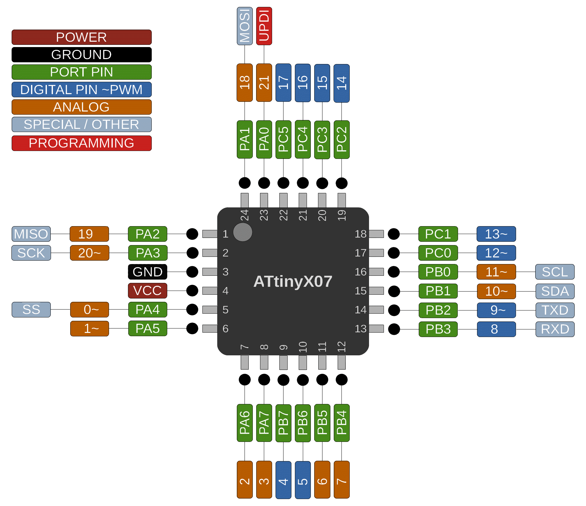

### ATtiny 807/1607

 Specifications |    ATtiny807  |    ATtiny1607
------------ | ------------- | -------------
Flash (program memory)   |  8192 bytes | 16384 bytes
Flash w/Optiboot   |  7680 bytes | 15872 bytes
RAM   | 512 bytes | 1024 bytes
EEPROM | 128 bytes | 256 bytes
Bootloader | Optiboot (optional) | Optiboot (optional)
GPIO Pins | 22 (21 usable) | 22 (21 usable)
ADC Channels | 12 (11 usable) | 12 (11 usable)
DAC | No | No
PWM Channels | 6 | 6
Timer Type B | 1 | 1
Timer Type D | No | No
Interfaces | UART, SPI, I2C | UART, SPI, I2C
Clock options | Internal 20/16/10/8/5/4/1 MHz | Internal 20/16/10/8/5/4/1 MHz

### Buy official megaTinyCore breakouts and support continued development!
### [ATtiny1607 assembled](https://www.tindie.com/products/17523/)
### [ATtiny3217/1617/817/417/1607/807 bare board](https://www.tindie.com/products/17613/)

### Datasheets and Errata
See [Datasheet Listing](Datasheets.md)
