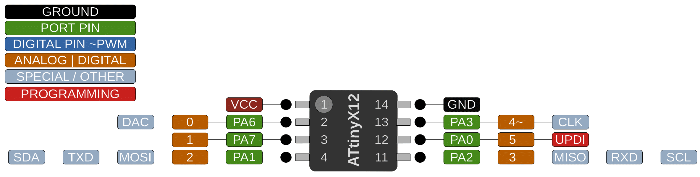

# ATtiny 212/412

 Specifications |  ATtiny212|  ATtiny412
------------ | ------------- | -------------
Flash (program memory)   | 2048 bytes | 4096 bytes
Flash w/Optiboot   | 1536 bytes | 3584 bytes
RAM  | 128 bytes | 256 bytes
EEPROM | 64 bytes | 128 bytes
Bootloader | Optiboot (No! Don't waste a quarter of the flash!) | Optiboot (optional, not recommended)
GPIO Pins | 6 (5 usable) | 6 (5 usable)
ADC Channels | 6 (5 usable) | 6 (5 usable)
DAC | Yes | Yes
PWM Channels | 4 | 4
Timer Type B | 1 | 1
Timer Type D | Yes | Yes
Interfaces | UART, SPI, I2C | UART, SPI, I2C
Clock options | Internal 20/16/10/8/5/4/1 MHz | Internal 20/16/10/8/5/4/1 MHz

## WARNING: On pre 2.0.0 versions of megaTinyCore, the UART defaulted to the alternate positions
This matches the megaTinyCore 412/402 Rev. - and Rev. A breakout boards below.. On bootloader . **In 2.0.0 and later, this is no longer the case!** You must call Serial.swap(1) prior to Serial.begin() to move it to the alt pins (or connect your adapter to pins 0 and 1 instead of 2 and 3). It should never have been done that way in the first place. Rev. B of the breakout boards that has the FTDI header tied to the standard serial pins is now available.

## LED_BUILTIN
The `LED_BUILTIN` macro point to pin 4 (PA3); on pre-Rev. B versions of my development board it was on pin 1 (PA7). matching the port and bit used for the higher pin count devices supported by this core, but as one of those pins is used for serial when the pins are not swapped, it was moved tp PA3.

## Buy official megaTinyCore breakouts and support continued development!
[ATtiny412/402 assembled](https://www.tindie.com/products/17685/)
[ATtiny412/212/402/202 bare board](https://www.tindie.com/products/17749/)

## Datasheets and Errata
See [Datasheet Listing](Datasheets.md)
