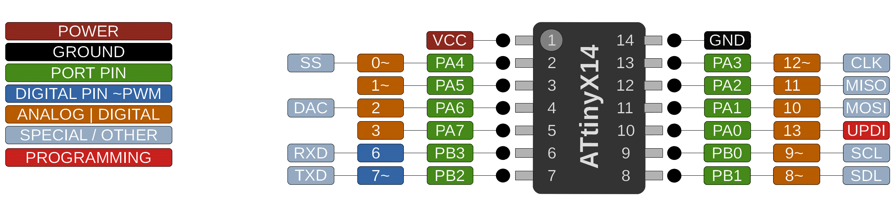

# ATtiny 214/414/814/1614

 Specifications |  ATtiny214 |  ATtiny414 |  ATtiny814  |    ATtiny1614
----------------|------------|------------|-------------|--------------
Flash           | 2048 bytes | 4096 bytes | 8192 bytes | 16384 bytes
Flash w/Optiboot| 1536 bytes | 3584 bytes | 7680 bytes | 15872 bytes
RAM             |  128 bytes |  256 bytes |  512 bytes |  2048 bytes
EEPROM          |   64 bytes |  128 bytes |  128 bytes |   256 bytes
Bootloader      | Optiboot (optional, not recommended) | Optiboot (optional, not recommended)| Optiboot (optional, not recommended) | Optiboot (optional, not recommended)
GPIO Pins       | 11 usable  |  11 usable |  11 usable |   11 usable
ADC Channels    |  9 usable) |  9 usable) |  9 usable) |    9 usable
DAC             |        Yes |        Yes |        Yes |         Yes
PWM Channels    |          6 |          6 |          6 |           6
Timer Type B    |          1 |          1 |          1 |           2
Timer Type D    |        Yes |        Yes |        Yes |         Yes
Interfaces | UART, SPI, I2C | UART, SPI, I2C | UART, SPI, I2C | UART, SPI, I2C

## Clock Options
These parts do not support an external HF crystal, only an external clock,  and/or a watch crystak for the RTC.
 MHz | Source
  20 | Internal, no tuning
  16 | Internal, no tuning
  10 | Internal, no tuning
   8 | Internal, no tuning
   5 | Internal, no tuning
   4 | Internal, no tuning
   1 | Internal, no tuning
  20 | Internal, tuned using previously gathered settings (see docs)
  16 | Internal, tuned using previously gathered settings (see docs)
  12 | Internal, tuned using previously gathered settings (see docs)
  20 | External Clock
  16 | External Clock
  10 | External Clock
   8 | External Clock
  24 | Internal, tuned OVERCLOCKED (see docs)
  25 | Internal, tuned OVERCLOCKED (see docs)
  30 | Internal, tuned OVERCLOCKED (see docs, osc. must be in 20 MHz mode)
  24 | External Clock (OVERCLOCKED)
  25 | External Clock (OVERCLOCKED)
  30 | External Clock (OVERCLOCKED)
  32 | External Clock (OVERCLOCKED, likely unstable)

The tuned options are new in 2.4.0 - see the readme amd associated page for exhaustive description of how it works and how to use it.
The type D timer is not used for PWM, but is the default millis timekeeping source.

## Buy official megaTinyCore breakouts and support continued development
[ATtiny1614 assembled](https://www.tindie.com/products/17598/)

[ATtiny1614/814/414/1604/804/404 bare board](https://www.tindie.com/products/17748/)

## Datasheets and Errata
See [Datasheet Listing](Datasheets.md)
