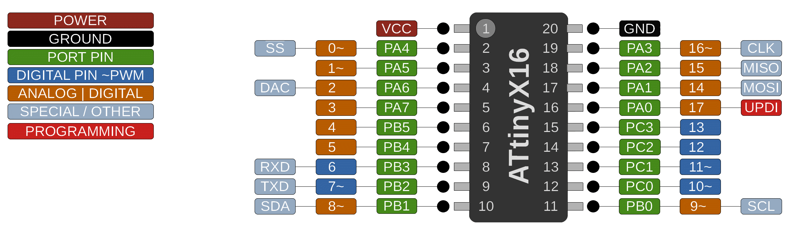

# ATtiny 416/816/1616/3216

 Specifications |  ATtiny416  |  ATtiny816  |    ATtiny1616   |   ATtiny3216
----------------|-------------|-------------|-----------------| -------------
Flash           |  4096 bytes |  8192 bytes |     16384 bytes | 32768 bytes
RAM             |   256 bytes |   512 bytes |      2048 bytes |  2048 bytes
EEPROM          |   128 bytes |   128 bytes |       256 bytes |   256 bytes
Bootloader | Optiboot (stongly not recommended)| Optiboot (awkard but viable, not recommended) | Optiboot (awkard but viable, not recommended) | Optiboot (awkard but viable, not recommended)
GPIO Pins       | 18/17 avail | 18/17 avail |     18/17 avail | 18/17 avail
ADC Channels    | 11 usable   | 11 usable   |       11 usable |   11 usable
DAC             |         Yes |         Yes |             Yes |         Yes
PWM Channels *  |           8 |           8 |               8 |           8
Timer type B    |           1 |           1 |               2 |           2
Timer Type D    |         Yes |         Yes |             Yes |         Yes
Interfaces | UART, SPI, I2C | UART, SPI, I2C | UART, SPI, I2C | UART, SPI, I2C

## Clock Options
These parts do not support an external HF crystal, only an external clock, and/or a watch crystak for the RTC.
 MHz | Source          | Notes
 ----|-----------------|-------
  20 | Internal        |
  16 | Internal        |
  10 | Internal        |
   8 | Internal        |
   5 | Internal        |
   4 | Internal        |
   1 | Internal        |
  20 | Internal, tuned |
  16 | Internal, tuned |
  12 | Internal, tuned |
  20 | External Clock  | External clock goes to CLKI (PA3). Minimize any load on this pin, including even short wires. HF stuff is very picky.
  16 | External Clock  | As above.
  10 | External Clock  | As above.
   8 | External Clock  | As above.
  24 | Internal, tuned | OVERCLOCKED, usually fine @ 5v and room temperature.
  25 | Internal, tuned | OVERCLOCKED, usually fine @ 5v and room temperature.
  30 | Internal, tuned | OVERCLOCKED, may be unstable.
  24 | External Clock  | OVERCLOCKED, usually fine @ 5v and room temperature. Uses CLKI/PA3 as above.
  25 | External Clock  | OVERCLOCKED, usually fine @ 5v and room temperature. Uses CLKI/PA3 as above.
  30 | External Clock  | OVERCLOCKED, may be unstable. Uses CLKI/PA3 as above.
  32 | External Clock  | OVERCLOCKED, may be unstable. Uses CLKI/PA3 as above.
When external clock is used as system clock source, it cannot be used for any other purpose (obviously) - all control over that pin is taken by CLKCTRL.

* The overclocked options at 24/25 MHz have been found to generally work around room temperature when running at 5v. The faster ones - while they can be stable with solid 5v supply at room temperature, this is right on the edge of what these parts can do. I have specimens that will run at 5.0v but not at 4.8, for example, meaning that it would work powered by some USB ports, but not others (they range from 4.7 to 5.3v) and they are of course extremely sensitive to noise on power rails. External oscillators work more reliably than the internal one when overclocking, but they generally cost about as much as the microcontroller itself and are gross overkill (in terms of accuracy) for what most arduino folks want from them.

The tuned options are new in 2.4.0 - see the [tuned internal oscillator guide](Ref_Tuning.md) for more information before using these options.

## The issue with bootloader
There's no dedicated reset pin. So there is no way to do the traditional autoreset circuit to reset the chip to upload with a bootloader unless you disable UPDI (requiring HV UPDI to undo - I've got a half dozen boards that are bricked until I have time to get an hvupdi programming setup together to resurrect them). Either you manually power cycle it just prior to trying to upload, or you have some sort of ersatz-reset solution coupled to an autoreset circuit, or handle it in some other bespoke way. Regardless of the approach, short of disabling UPDI, none of them are as convenient a development cycle as we're used to. In most cases, the most convenient development configuration is to simply use UPDI programming, and leave any serial connection open while programming via UPDI using a programmer on a different port. Note that the 2-series 20 and 24 pin parts have enhancements that make a bootloader capabloe of providing a better developer experience possible.

On parts with less than 8k, in addition to the woes surrounding bootloader entry, you also end up sacrificing 1/4th or 1/8th of the flash to a bootloader, which strikes me as an outrageously large fraction.
## Buy official megaTinyCore breakouts and support continued development
[ATtiny3216 assembled](https://www.tindie.com/products/17597/)

[ATtiny3216/1616/816/416/1606/806/406 bare board](https://www.tindie.com/products/17614/)

## Notes on Tables
`*` PWM channels exposed with default configuration via analogWrite(); TCA0 is in split mode, TCD0 used for two PWM channels, and the type B timer(s) are not used for PWM.

## Datasheets and Errata
See [Datasheet Listing](Datasheets.md)
