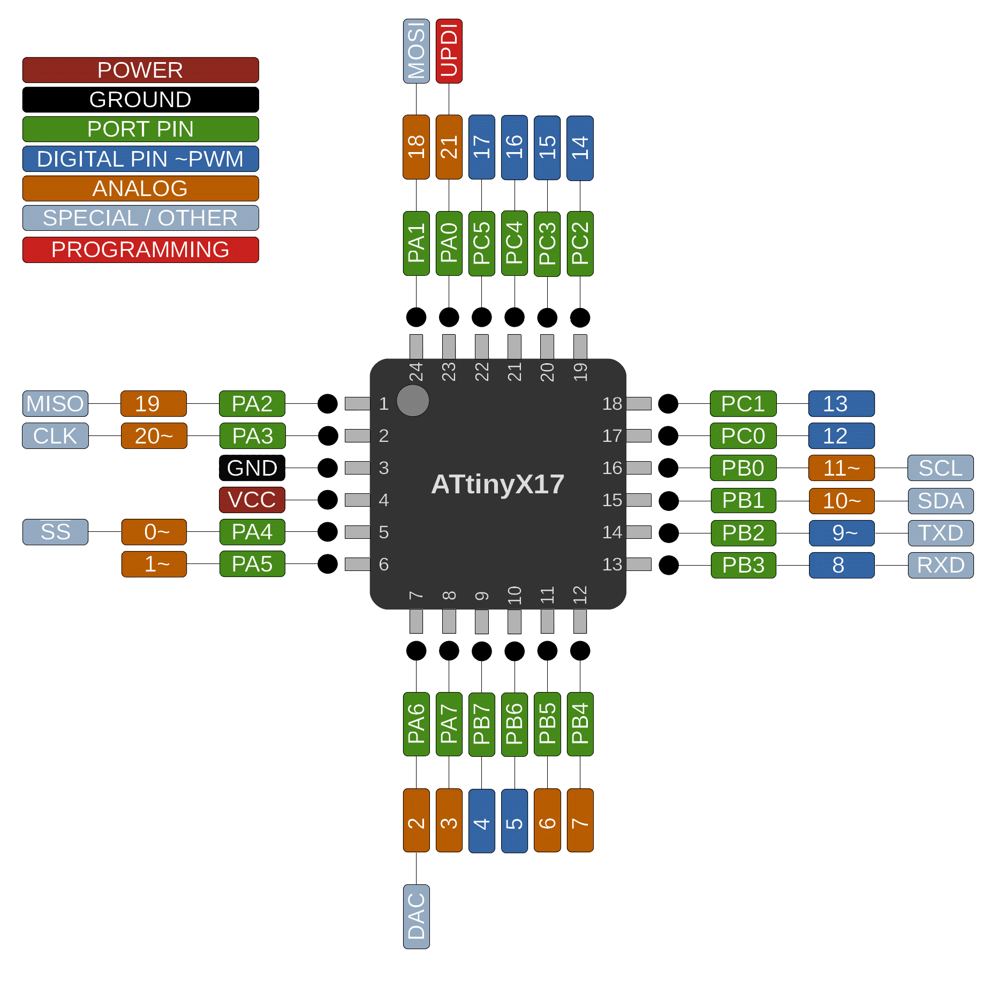

# ATtiny 417/817/1617/3217

 Specifications |  ATtiny417  |  ATtiny817  |    ATtiny1617   |   ATtiny3217
------------ | ------------- | ------------- | ------------- | -------------
Flash (program memory)   | 4096 bytes| 8192 bytes | 16384 bytes | 32768 bytes
Flash w/Optiboot   | 3584 bytes| 7680 bytes | 15872 bytes | 32256 bytes
RAM  | 256 bytes | 512 bytes | 2048 bytes | 2048 bytes
EEPROM | 128 bytes | 128 bytes | 256 bytes | 256 bytes
Bootloader | Optiboot (optional, not recommended) | Optiboot (optional, not recommended)| Optiboot (optional, not recommended) | Optiboot (optional, not recommended)
GPIO Pins | 22 (21 usable) | 22 (21 usable) | 22 (21 usable) | 22 (21 usable)
ADC Channels | 12 (11 usable) | 12 (11 usable) | 12 (11 usable) | 12 (11 usable)
DAC | Yes | Yes | Yes | Yes
PWM Channels | 8 | 8 | 8 | 8
Timer Type B | 1 | 1 | 2 | 2
Timer Type D | Yes | Yes | Yes | Yes
Interfaces | UART, SPI, I2C | UART, SPI, I2C | UART, SPI, I2C | UART, SPI, I2C
Clock options | Internal 20/16/10/8/5/4/1 MHz | Internal 20/16/10/8/5/4/1 MHz | Internal 20/16/10/8/5/4/1 MHz | Internal 20/16/10/8/5/4/1 MHz

## Buy official megaTinyCore breakouts and support continued development
[ATtiny3217 assembled](https://www.tindie.com/products/17523/)

[ATtiny3217/1617/817/417/1607/807 bare board](https://www.tindie.com/products/17613/)

## Datasheets and Errata
See [Datasheet Listing](Datasheets.md)
