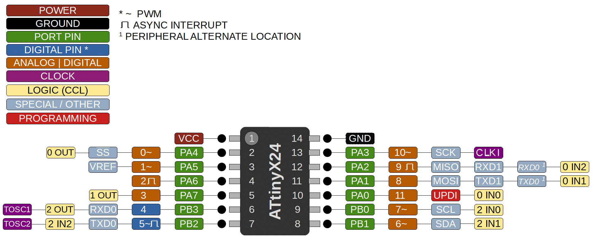

# ATtiny 424/824/1624/3224

 Specifications |  ATtiny424|  ATtiny824  |  ATtiny1624  |    ATtiny3224
------------ | ------------- | ------------- | ------------- | -------------
Flash (program memory)   | 4096 bytes | 8192 bytes | 16384 bytes | 32768 bytes
Flash w/Optiboot   | 3584 bytes | 7680 bytes | 15872 bytes | 32256 bytes
RAM  | 512 bytes | 1024 bytes | 2048 bytes | 3072 bytes
EEPROM | 128 bytes | 128 bytes | 256 bytes | 256 bytes
Bootloader | Optiboot (optional, not recommended) | Optiboot (optional, not recommended)| Optiboot (optional, not recommended) | Optiboot (optional, not recommended)

Feature   | Specification  |
----------|----------------|
GPIO Pins | 12 (11 usable) |
ADC       | 12-bit, differential w/PGA |
ADC Channels | 9, 7 can be neg. diff. pin. |
DAC | Internal for AC ref only|
Comparator | 1 |
PWM Channels | 6 |
Timer Type B | 2 |
Timer Type D | No |
CCL logic | 4 LUTs  |
Interfaces | UART (2), SPI, I2C |
Millis timing options | TCA0, TCB0, TCB1 (default), RTC
RTC crystal   | Optional, TOSC1, TOSC2 |
Package | SOIC-14, SSOP-14 |

The smallest pincount of the tinyAVR 2-series parts. These have been announced in the full range of flash size options - Hopefully it won't be a repeat of the 3214 which was in the ATpacks, but never actually shipped, and had all references to it removed. Notice that some 1-series features - mostly the extravagances of the "golden" 1-series parts - are gone, while the second type B timer (thankfully) is present in all sizes. The main features though are the fancy ADC, and the second USART - as well as a 32k version with 3k SRAM. The expanded RAM on the 4k and 8k parts goes a long way to making those parts more practical option.

The super ADC can accumulate 1024 samples in a single burst read; decimation of the accumulated value so all of the digits are meaningful can give up to 17-bits of accuracy. For advanced ADC functionality, several new functions are provided, see ADC section of the main readme for more information.

Unlike the higher pincount devices, you can't have an alternate reset here (the pin it can be moved to doesn't exist here), so these have the same reset-pain as the 1-series. We default to TCB1 for millis, since there is no type D timer, and because we have TCB0 for tone or TCB-dependant libraries, TCA0 is more likely to be needed than a second TCB - [taking over TCA0](TakingOverTCA0.md) seems to be quite popular.

Optiboot will be available in a future release, there are minor adjustments needed, and I think the board configuration options there are different enough from 0/1-series, particularly for the 20 and 24-pin parts, that they are better served by their own top level board menu option.

## Buy official megaTinyCore breakouts and support continued development!
TBD

## Datasheets and Errata
See [Datasheet Listing](Datasheets.md)
