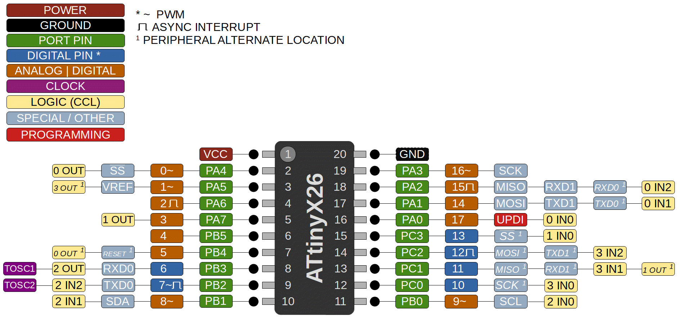

### ATtiny 426/826/1626/3226

 Specifications |  ATtiny426|  ATtiny826  |  ATtiny1626  |    ATtiny3226
------------ | ------------- | ------------- | ------------- | -------------
Flash (program memory)   | 4096 bytes | 8192 bytes | 16384 bytes | 32768 bytes
Flash w/Optiboot   | 3584 bytes | 7680 bytes | 15872 bytes | 32256 bytes
RAM  | 512 bytes | 1024 bytes | 2048 bytes | 3072 bytes
EEPROM | 128 bytes | 128 bytes | 256 bytes | 256 bytes
Bootloader | Optiboot (optional, not recommended) | Optiboot (optional)| Optiboot (optional) | Optiboot (optional)

Feature   | Specification  |
----------|----------------|
GPIO Pins | 18 (17 usable, 16 with alt-reset) |
ADC       | 12-bit, differential w/PGA |
ADC Channels | 15, 7 can be neg. diff. pin. |
DAC | Internal for AC ref only| 
Comparator | 1 |
PWM Channels | 6 |
Timer Type B | 2 |
Timer Type D | No |
Interfaces | UART (2), SPI, I2C |
Clock options | Internal 20/16/10/8/5/4/1 MHz |
RTC crystal   | Optional, TOSC1, TOSC2 |

The 20-pin 2-series parts bring one very exciting feature, particularly for those who like using serial bootloaders instead of UPDI - the Reset function can be moved to pin PB4, allowing PA0 to remain UPDI, while also having a proper hardware reset! These are being advertised in SOIC-20 and the super tiny 3mm x 3mm QFN of the 1-series, plus SSOP. Not sure SSOP will set the world on fire. It's also not certain yet if they will actually make the 32k parts available in the QFN - fingers crossed. 

DAC, TCD, and the extra analog comparators have been removed in favor of a second UART, and the super ADC, which can accumulate 1024 samples in a single burst read; decimation of the accumulated value so all of the digits are meaningful can give up to 17-bits of accuracy. For advanced ADC functionality, several new functions are provided, see ADC section of the main readme for more information.

### Buy official megaTinyCore breakouts and support continued development!
TBD

### Datasheets and Errata
See [Datasheet Listing](Datasheets.md)
