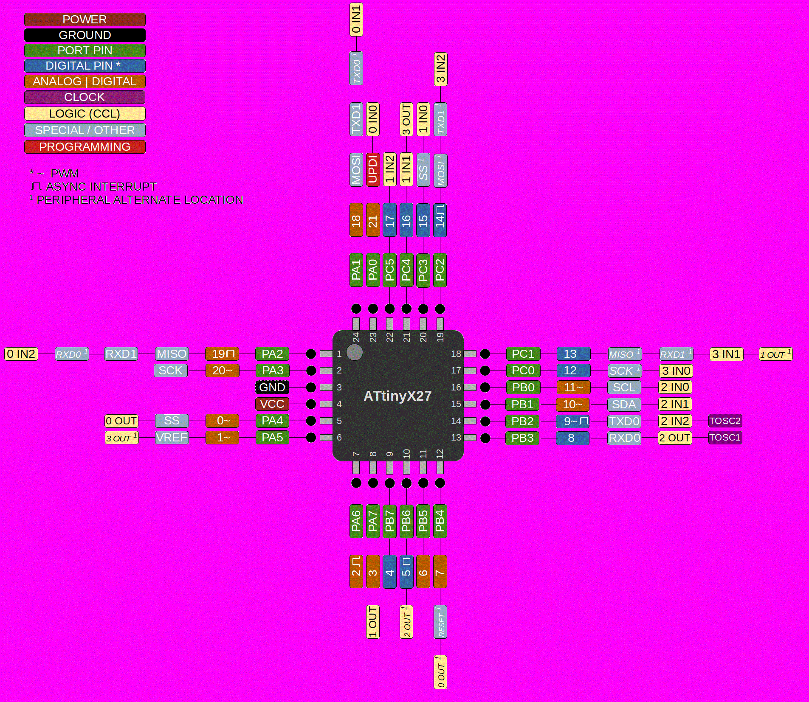

# ATtiny 427/827/1627/3227

 Specifications |  ATtiny427  |  ATtiny827  |    ATtiny1627   |   ATtiny3227
------------ | ------------- | ------------- | ------------- | -------------
Flash (program memory)   | 4096 bytes | 8192 bytes | 16384 bytes | 32768 bytes
Flash w/Optiboot   | 3584 bytes | 7680 bytes | 15872 bytes | 32256 bytes
RAM  | 512 bytes | 1024 bytes | 2048 bytes | 3072 bytes
EEPROM | 128 bytes | 128 bytes | 256 bytes | 256 bytes
Bootloader |  Optiboot (optional, not recommended)  |  Optiboot (optional) |  Optiboot (optional)  |  Optiboot (optional)

Feature   | Specification  |
----------|----------------|
GPIO Pins | 22 (21 usable, 20 with alt-reset) |
ADC       | 12-bit, differential w/PGA |
ADC Channels | 15, 7 can be neg. diff. pin. |
DAC | Internal for AC ref only|
Comparator | 1 |
PWM Channels | 6 |
Timer Type B | 2 |
Timer Type D | No |
CCL logic | 4 LUTs  |
Interfaces | UART (2), SPI, I2C |
RTC crystal   | Optional, TOSC1, TOSC2 |
Package | VQFN-24, 4mm x 4mm |

The 24-pin 2-series benefit from fact that the Reset function can be moved to pin PB4, allowing PA0 to remain UPDI, while also having a proper hardware reset! Like the 24-pin 0/1-series, the VQFN-24 package is the only option, no doubt a disappointment to those hoping to assemble them at home.

DAC, TCD, and the extra analog comparators have been removed in favor of a second UART, and the super ADC, which can accumulate 1024 samples in a single burst read; decimation of the accumulated value so all of the digits are meaningful can give up to 17-bits of accuracy. For advanced ADC functionality, several new functions are provided, see ADC section of the main readme for more information. We also get a full suite of 4 CCL logic blocks and both the CCL and event system are fully functional here, and well behaved like the megaAVR 0-series and Dx-series, not the no-interrupt version of the CCL, or the confusing event system with two kinds of chanenls. You do start to miss the TCD's extra PWM pins as you get up to 20 GPIO pins, but you're still stuck with just one good PWM timer... Oh well - the point of the 2-series is the dual serial and the killer ADC...

The 427 will have another claim to fame ones will also be the lowest cost part with 4 CCL LUTs, the 24-pin ones having all CCL lines on actual pins (not that you usually need them all on physical pins - actually it looks like all of the 24-pin 2-series will be cheaper than anything else with 4 LUTs. The smallest flash DD-series might challenge the 32k tinyAVR 2-series though...

Optiboot will be available in a future release, there are minor adjustments needed, and I think the board configuration options there are different enough from 0/1-series, particularly for the 20 and 24-pin parts, that they are better served by their own top level board menu option.

## Buy official megaTinyCore breakouts and support continued development!
TBD

## Datasheets and Errata
See [Datasheet Listing](Datasheets.md)
