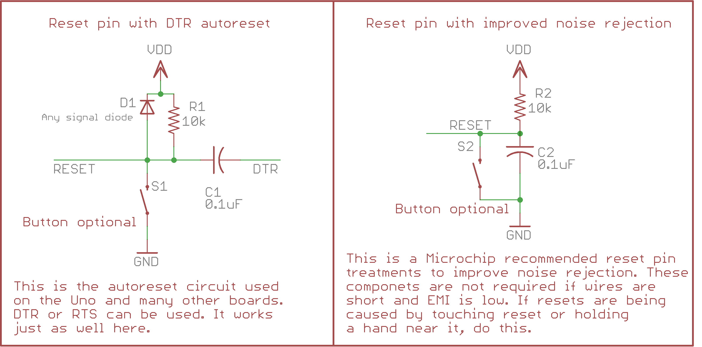

# Reference: All about Resets
Various reset sources are available, these conditions trigger a "hardware reset" with every register (except for the reset flag register, discussed shortly) reset to it's default value. Thus far all modern AVRs have had the same six reset sources. All are frequently encountered, and are important to understand. It's also important to be aware of the possibility that your code could reset - or appear to - without the chip actually resetting. I refer to this as a "dirty reset", and it is a Bad Thing. Frequently that is what is happening when you see an AVR get into a bad state after some adverse event, and not work until powercycled or reset (since the dirty reset detection went in, there should be very few of these). megaTinyCore will catch "dirty resets" pretty well, and reacts with a softweare reset (SWR) through the reset controller - in order to do this, however, at startup either the core, or the bootloader (if building for optiboot) will copy the reset flag register to GPIOR0 (so your code can use it) and then clear it (that way, when it next checks and sees that the register is zero, it knows the reset was dirty, the state of the hardware cannot be assumed. The least bad thing that can be done in the general case at that point, is to issue a proper reset, and that is what the core does. Because the only register that is specified to retain state across resets.

Note that a necessary consequence of the dirty-reset guard is that a duplicate guard will break, because the only way any dirty reset can be detected is if the reset flag register has been cleared before the dirty reset occurs. So in order to catch any dirty reset that could occur in bad user code, we must reset the reset flags first. Since checking and resetting the reset flags is essentially not present in the wild, despite being a basic and simple safeguard against the most severe and difficult to understand bugs, while properly the responsibility of an application, is performed by the core. Three behaviors have been used by various bootloaders. It is the opinion of the author of this document and the majority of this core that only one is correct.
1. The bootloader may do nothing. This is clearly a bug on classic AVRs (the bootloader takes longer than 16ms to run and, having neither reset the WDT nor turned it off, resets endlessly - this is an odd course of action for a bootloader to take, since the bootloader frequently exits by using), but was present on the original nano and pro mini bootloaders, which is why these boards are generally bootloaded as if they are Unos. On modern AVRs, this does not cause overt misbehavior, however neither does it prevent it. It is fully up to the app to detect and mitigate dirty resets (which as noted is essentially unhearof, and I do not expect to upgrade the wetware of every arduino user, especially when, as in this case, the correct respons is always the same - You issue a software reset, because you are in an unmitigated error condition. This error condition occurs specifically because of something unforseen and unintended occurring in code.
  a. Intentionally triggering a dirty reset was dangerouns and inadvisable practice on classic AVRs to workaround the bug in early bootloaders that failed to handle the WDRF properly; the correct course of action is to bootload those devices as Unos or using MiniCore, and use the WDT to reset, not to trigger dirty resets directly by jumping to 0x0000.
2. The bootloader clears only WDRF. If a classic AVR, it turns off the WDT. Other reset flags left in place. This was used by Optiboot classically, and is, for example, what the Uno does. This achieves minimum functionality but because only WDRF is cleared, it is still left to user code (which can be relied upon not to do it) to clear RSTFR in order not only to detect dirty resets (which as far as I am aware was not done) and decide upon entry to the bootloader. That is to say, on a classic or modern AVR, the bootloader entry conditions are honored only if the user code clears RSTFR. Most users are unaware of this register, and hence do not reset it, and thus once the reset button has been pressed once, EXTRF remains set, until a BOR or POR occurs. Since EXTRF is the entry condition for the bootloader, RSTRF

The reset sources are listed below. Note that for brevity and familiarity to those who used older AVRs, the reset sources are referred to by the parenthecised abbreviations and the reset flag is referred to without the underscores or the part before and after them, ex PORF. The first four reset flags also existed on classic AVRs and with the exception of WDRF, (see above) behaved the same way. Unlike a classic AVR, all resets are equal, except for their effects on `RSTCTRL.RSTFR`, with the sole exception of of the power on reset, which is different by nature, and cannot behave the same way (all volatile memory is lost in a POR, and hence everything is reset, including a small number of registers that are missed, often in error, by the normal reset routine).

The reset sources are listed below. Note that for brevity and familiarity to those who used older AVRs, the reset sources are referred to by the parenthecised abbreviations and the reset flag is referred to without the underscores or the part before and after them, ex PORF. The first four reset flags also existed on classic AVRs and with the exception of WDRF, behaved much the same way (WDRF was special on classic AVRs and had to be cleared in order to turn off the WDT, that is not the case anymore.

| Reset Source         | Flag name         | Flag bit |   .  | Notes     |
|----------------------|-------------------|----------|------|------------
| UPDI Reset           | RSTCTRL_UPDIRF_bm |  1 << 5  | 0x20 | Done during programming several times. |
| Software Reset (SWR) | RSTCTRL_SWRF_bm   |  1 << 4  | 0x10 | When requested by the application |
| Watchdog Reset (WDR) | RSTCTRL_WDRF_bm   |  1 << 3  | 0x08 | When WDT expires w/out wdr instruction<br/>wdr executed before window in windowed mode|
| External Reset       | RSTCTRL_EXTRF_bm  |  1 << 2  | 0x04 | When reset pin is brought LOW |
| Brownout Reset (BOR) | RSTCTRL_BORF_bm   |  1 << 1  | 0x02 | When Vdd lower than BOD threshold and BOD enabled. |
| Power on reset (POR) | RSTCTRL_PORF_bm   |       1  | 0x01 | On power on (Vdd goes above V<sub>POR</sub> from below V<sub>PORR</sub>)

* All of these resets restore the peripheral registers [(SFRs)](https://github.com/SpenceKonde/AVR-Guidance/blob/master/Glossary.md#sfr) to their power on state - with the exception of the reset flag register, amd a small number of things that ONLY POR resets:
  * Some parts fail to reset the BOD/VLM registers except on POR (see errata if you're using VLM).
  * If an HV pulse was applied to the reset/UPDI pin successfully to force it into UPDI mode only POR will reset the pin to be GPIO or reset.
  * All reset flags are cleared by a POR (except for PORF itself which is set)
* The WDT does not turn itself back on when it causes a reset on modern AVRs. This is cause for celebration! That had been a source of constant annoyance in the past. It now defers to the fuses, which may or may not turn it back on. Thus, it is far less of a pain to use it to generate a software reset.
* But we also have a true software reset! So we can have the software working as intended and choose to reset, or detect a hang and reset itself *and tell the difference between those cases* subsequent to the reset event. (note - this does not work the same way on optiboot, see below)
* A BOR will clear all other reset flags except PORF, and set BORF.
* A WDRF or SWRF should never occur at the same time as another reset if the flags are being reset. I am not aware of anyone having attempted to precisely time a SWR to line up very closely with a WDR. It is possible there is a brief window within which a software reset could result in both occurring (Please let me know if you do so! This is a free-hardware worthy discovery, though largely for academic interest.) I would suggest checking within the period of time immediately before the reset (which you do not know precisely because calibration of the 32k osc varies between parts. I would suggest the algorithm of a sketch which checked the reset flags (remember that we stash them in GPIOR0) and indicated whether either of those pins were set by setting a pin state. You could then either manually or automatically adjust the delay period after the WDR is turned on, (and store it to EEPROM)), and increase it if a SWRF alone was found. One thing to remember is that you do not need accuracy, only precision, because it is exceedingly unlikely that a reset oc
* UPDIRF may co-occur with other flags if if those other reset conditions occurred during UPDI mode, even when flags are being reset properly.

| PORF | EXTRF | BORF | Meaning |
|------|-------|------|---------|
|    1 |     0 |    0 | Reset occurred and voltage rose from below V<sub>POR</sub> to V<sub>BOR</sub> before BOR had engaged.
|    0 |     0 |    1 | Reset occurred when voltage fell below V<sub>BOR</sub> and then recovered without reaching.
|    1 |     0 |    1 | Reset occurred because ramp from below V<sub>POR</sub> to V<sub>BOR</sub> was slow. BOD was enabled, but the weak power supply was still supplying less than V<sub>BOR</sub>. This situation should be unusual.
|    1 |     1 |    X | The reset pin voltage significantly more slowly than VDD, possibly due to loading and insufficient pullup strenth on the reset pin (You should immediately suspect that there is an issue with autoreset if you are using that - Perhaps a different (larger) value capacitor was used? Could the pullup be disconnected?). This has the visible consequence that the bootloader runs on startup. Even when a sketch is present and the reset button was never pressed.  While ideally it should not occur, it is also not indicative of the sort of "drop everything and find this bug" situation, whereas a starting with no flags set indicates a criticial failure occurring, and ought never be tolerated, but rather investigated promptly.

### The power of two software resets
The fact that there are now two ways of resetting from software changes things. There is an obvious way that both features can be used (an application uses the WDT to detect that it has gotten hung up somewhere and reset itself, and issues a software reset when some set of conditions is met or per user command). This is likely the most common use of them outside of Arduino. But there is also a second way that these can be used, and this is how we use it by default - Use SWRF as a "reset and run bootloader" while you can trigger resets without SWRF by the standard method of setting the WDT for minimum time and then going into forever loop which will trigger the reset.

It is not recommended to set windowed mode and continualy send WDRs. You're doing something strange. When someone else reads it, or you read it later, you will likely have to come back and read either this document or the datasheet to understand how continually WDRs which normally would prevent the WDT from resetting, but for windowed mode. That would be okay - an ugly hack if it would reult in elimiating the 8 ms wait - but it just replaces it with a slightly slower one - WDRs, like everything related to the WDT, have a 2-3 WDT clock sync delay. The WDT clock is around 1 kHz derived from the internal 32 kHz ULP. Once you write the settings to the WDT register, it will take 2-3ms. Then the timer starts up. Now you can execute WDR, and it's no longer a no-op. The first WDR goes in - but you can't queue up a second WDR - WDR will again be a no-op unil, 2-3 ms later, the first WDR finishes syncing; it will reach the WDT and reset the timer - only after this first WDR is the window used, and only after that WDR is synced will a WDR instruction do start syncing a WDR. 2-3 ms later, it will finallly slam into the closed window. Now a total of 3 sync periods have happened, for a total of 6-9 ms If we had not done this and simply used the shortest timeout, we would reset in 10-11 ms (2-3 ms sync before it turns on, minimum setting of 8 WDT ticks as WDT period. We could save as little as 1ms or as much as 6ms.

No matter what, triggering a reset with the WDT hence takes far longer than other methods., but at 11 ms, still a very short period of tme by human standards.

## Determining reset cause
The cause of reset is recorded whenever any reset takes place. These flags are normally only cleared manually. Because of the importance of verifying that there is always a reset cause when the sketch restarts (to prevent dirty resets, as of 2.5.0, both optiboot and the normal sketch will check for blank flags, reset if it sees them, and otherwise, clear them. It will save the reset cause to the `GPIOR0`  and clear all of the flags. The 6 lower bits are used to record UPDI reset, Software Reset, Watchdog Reset, External Reset, Brownout Reset and Power-on Reset, in that order. Multiple can be set at once when multiple reset conditions occur. A BOD reset often happens as the power supply voltage is ramping up.

When you see unexpected resets, check the reset cause! If it's showing as software reset - this is likely what's happening. You can override init_reset_flags() to turn on LEDs or something like that to indicate how you got there - but you are forced to work under very painful conditions: Using Serial, any arduino timekeeping functions are out of the question, etc. The system is not so hosed that you can't turn on a pin, though, and you can generate delays with delay_us() and delay_ms() in `<util/delay.h>` (provided they are compile time known constant delays) and use that to blink a LED, thought the rate at which it is blinking may be very different than you intended). The best way to avoid this problem is to preempt it. Test often. If suddenly it starts throwing dirty resets, well, you know what you were working on before this started happening. Did you add some code to write to an array? Maybe you wrote past the end of it. Did you add an interrupt? Are you sure the vector is spelled right and you're enabling the right interrupt? (see below for more causes of a dirty reset). Dirty resets are BY FAR the most common cause of hangs and Arduinos getting into a "bad state"; the recent changes should make these far less likely to result in anything more than a surprise reset. Which is a very bad failure, but not as bad as the part hanging until the batteries die or you climb up the tree you mounted it in to press the reset button.

## The Reset Pin
When the reset pin is acting as reset - which unfortunately is uncommon on tinyAVRs because the pin can't be used for UPDI programming if set to act as reset (on the 20 or 24-pin tinyAVR 2-series, PB4 can be configured to act as reset instead, but that is not an option on other parts), it requires HV reprogramming to write to them over UPDI afterwards; that is beyond the scope of this particular document). When acting as reset , the pullup is always enabled. If the pin is ever brought to a logic LOW, it will reset the chip. This is pretty much the same behavior as on classic AVR's (contrary to some posts on forums, you do not *need* to have an external pullup on reset - though it is recommended when the pin is used for reset. ) Just like on the classic AVRs, you should never jumper an output pin to reset and drive it low to reset. (We have two great ways to reset from software now!).


### AutoReset
Normal Arduino boards autoreset when the serial port is opened. It does this through the "DTR autoreset circuit". AVRdude, like any program that doesn't override the default behavior will set DTR and RTS lines low while the serial port is open. This circuit converts the transition into a pulse, allowing the chip to leave reset too. (your finer serial terminals let you control these two pins. Generally speaking DTR and RTS are interchangeable, and you use whichever one the serial adapter makes available more easily).

Obviously this design depends on having the pin set as reset. **Don't connect an autoreset circuit if you are programming through the same pin via UPDI**, as those components will prevent all UPDI programming. The same circuit can be used with the alternate reset pin on the larger 2-series parts, or on older models through "Ersatz reset" - otherwise known as a LOW interrupt on a pin, with the ISR consisting of a software reset call. Unlike normal reset pin resets, ersatz reset is not bulletproof (you can make it better by elevating the priority of the interrupt though).
It will reset the chip when serial connection is opened like on typical Arduino boards. When using a bootloader, this is very convenient and allows for "normal" uploads without manually resetting it. When no bootloader is in use, it is still often useful to ensure that you see all the output from the start of the sketch.

On the other hand, it is sometimes preferable to have one adapter connected to the serial port continually with a tool outside Arduino (I recommend never using the pitiful excuse for a serial adapter they give us in the IDE. On Windows, "hterm" is my preferred tool) . Occasionally (for example, if you have it connected to a computer controlling a long running task, but the computer has turned itself off and gone into power save mode) autoreset is your enemy. Reestablishing a connection would trigger autoreset in that case, while if it were not present, that isn't an issue. So you don't *always* want autoreset.

The internal pullup on Reset is always enabled as long as the pin hasn't been turned into a normal input. This internal pullup, like all the others, is fairly weak. Adding a 10k resistor to Vcc, even if not using the full autoreset circuit, can provide improved noise rejection, though it is not required. If you aren't using autoreset at all, but noise on the reset pin is expected to or has been found to be a problem, combine the resistor with a 0.1uF cap between Reset and Ground, which will not interfere with a reset button, but will prevent plausible sources of electrical noise from causing and unwanted reset. A capacitor between reset and ground will defeat autoreset (though in order to be guaranteed to be effective, it must be at least 4 times the value of the autoreset capacitor to be certain of preventing a reset, though one as small as 1/9th the value of the autoreset capacitor could potentially interfere (the classical method of using a capacitor of 10 uF to disable autoreset on an Uno with a 0.1uF autoreset cap greatly exceeds what is necessary, and was clearly designed to work in spite of numerous mistakes being made). You can of course also just use a jumper or solder bridge tro enable anddisable autoreset, like my breakout boards do. With 3 pins instead of 2, arranged such that jumping one pair enables autoreset, and the other ties the nominally-dtr side of the cap to ground would provide a  way to select either noise rejection or autoreset.

A representative schematic is shown on the left below.

* 1 Small signal diode (specifics aren't important, as long as it's approximately a standard or schottky diode some big honkin thing meant to take amps. Schottky is or silicon diodes are fine here)
* 1 0.1uF Ceramic Capacitor
* 1 10k Resistor

If you aren't using autoreset, but the pin is still reset, it is suggested to connect that capacitor and resistor as shown on the right.





If the reset pin is still causing spurious external resets with that sort of countermeasure, after verifying that the resets are actually external resets, rather than some other kind, you should question whether the reset line is somehow unintentionally connected to a data line or similarly mis-wired. Overcoming a 10k resistor and 0.1uF capacitor takes an unusually large amounts of EMI, and is not plausible except in the most extreme circumstances. Whatever the reason, it likely points to a design flaw somewhere. However, unlike classic AVR parts you can disable reset without causing any problems reprogramming these parts

## Triggering a reset from software
These parts support a native software reset operation; on classic AVRs, the only way was to enable the watchdog timer, and then wait for it to time out. With the modern AVR devices, there are two ways to trigger a reset from software: A watchdog timer reset (as before), and the native software reset. Unlike classic AVRs, after a WDT reset, the watchdog timer is not forced on with the minimum timeout (on classic devices, this is why doing a WDT restart with very old bootloaders instead hung the board - the bootloader wasn't smart enough to turn it off before it was reset by it).

These two methods of resetting the chip allow you a crude means of signaling to the application or bootloader what sort of condition triggered the reset.

Additionally, while the bootloader, if used (see below) will run after a software reset, it will NOT run after a watchdog reset (well - it will run, but only long enough to read the reset flag register and see that it was restarted by the WDT: That means that either the bootloader just ran, finished, and reset the device (If we didn't jump to the app in this case, we'd just sit in the bootloader doing WDT resets forever), that the application suffered from a WDT timeout due to a bug or adverse conditions (that's not the bootloader's business to get involved in) or that the application intentionally triggered a WDT reset. None of those are "entry conditions" for the bootloader, so it just stashes the reset flags, clears them, and jumps to the app).This allows the application a convenient mechanism to restart itself without having to potentially wait through the bootloader attempting to communicate with whatever is connected to the serial port.

Note: While the windowed mode would at first seem to suggest that you could trigger a WDT reset much faster by setting it and then executing `WDR` until it resets from missing the window, you don't gain nearly as much as you'd think. First, the initial WDR needs to be synchronized - 2-3 WDT clocks, ie, 2-3 ms. Additional WDRs executed while this is happening are ignored. Only when the second WDR makes it to the watchdog timer domain will it reset the system. So the overall time to restart is 6-9ms. Instead 10-11 ms (sync delay + minimum timeout).

```c++
void resetViaWDT() {
  _PROTECTED_WRITE(WDT.CTRLA,WDT_PERIOD_8CLK_gc); //enable the WDT, minimum timeout
  while (1); // spin until reset
}

```c++
void resetViaWDTFaster() {
  _PROTECTED_WRITE(WDT.CTRLA,WDT_WINDOW_8CLK_gc | WDT_PERIOD_8CLK_gc); //enable the WDT, minimum timeout, minimum window.
  while (1) __asm__ __volatile__ ("wdr"::);
  // execute WDR's until reset. The loop should in total take 3 clocks (the compiler will implement it as wdr, rjmp .-4)
  // but because of the sync delay described above, it will run thousands of times before the first premature (from the
  // WDT's perspective) wdr finally makes it to the WDT domain and slams into the closed window.
}

void resetViaSWR() {
  _PROTECTED_WRITE(RSTCTRL.SWRR,1);
}
```

The two recommended methods, resetViaWDT() and resetViaSWR() are provided by megaTinyCore.h

## Using watchdog to reset when hung
If you only worked with the watchdog timer as an Arduino user - you might not even know why it's called that, or what the original concept was, and just know it as that trick to do a software reset on classic AVRs, and as a way to generate periodic interrupts (which it can't do on a modern AVR - though the much more powerful and full features RTC can be used instead). The "purpose" of a watchdog timer is to detect when the part has become hung - either because it's wound up in an infinite loop due to a bug, or because it wound up in a bad state due to a glitch on the power supply or other adverse hardware event, has been left without a clock by an external clock source failing, went to sleep waiting for some event which doesn't end up happening (or without correctly enabling whatever is supposed to wake it up) - and issue a reset. It is often anthropomorphized as a dog, who needs to be "fed" or "pet" periodically, or else he will "bite" (commonly seen in comments - the latter generally only when we are expecting it, as in `while (1); //wait for the watchdog to bite`).

You would first initialize the WDT like:
```c++
_PROTECTED_WRITE(WDT.CTRLA, settings); //enable the WDT
```

To configure the WDT to reset the device after a period of time, replace `settings` above with the desired WDT timeout period from this table. If is getting stuck somewhere that causes it to repeatedly reset the WDT or you are concerned that it might, you can configure it in window mode to reset if an attempt is made to reset the watchdog timer within the specified period. To do this, bitwise OR the two, eg: `_PROTECTED_WRITE(WDT.CTRLA, WDT_PERIOD_8KCLK_gc | WDT_WINDOW_16CLK_gc );` would set the WDT to reset the device if two attempts to reset the watchdog were ever made within 16 milliseconds of the previous one (before the "window" opens), or if no reset was performed in the 8 seconds after that (when the window closes). If no window period is included, there will be no delay before the window opens after the last wdr instruction. Note that in all cases, multiple wdr instructions fired in very rapid succession (2-3 ms) will be ignored: A wdr does nothing if the AVR is in the process of syncing a WDR already. The window mode only starts opening and closing the window after the first wdr reaches the timer after being configured.
A configuration with a window setting but no period has behavior that is not defined. This should not be used.


| Timeout | WDT period name      | WDT Window name      |
|---------|----------------------|----------------------|
|  0.008s | WDT_PERIOD_8CLK_gc   | WDT_WINDOW_8CLK_gc   |
|  0.016s | WDT_PERIOD_16CLK_gc  | WDT_WINDOW_16CLK_gc  |
|  0.032s | WDT_PERIOD_32CLK_gc  | WDT_WINDOW_32CLK_gc  |
|  0.064s | WDT_PERIOD_64CLK_gc  | WDT_WINDOW_64CLK_gc  |
|  0.128s | WDT_PERIOD_128CLK_gc | WDT_WINDOW_128CLK_gc |
|  0.256s | WDT_PERIOD_256CLK_gc | WDT_WINDOW_256CLK_gc |
|  0.512s | WDT_PERIOD_512CLK_gc | WDT_WINDOW_512CLK_gc |
|  1.024s | WDT_PERIOD_1KCLK_gc  | WDT_WINDOW_1KCLK_gc  |
|  2.048s | WDT_PERIOD_2KCLK_gc  | WDT_WINDOW_2KCLK_gc  |
|  4.096s | WDT_PERIOD_4KCLK_gc  | WDT_WINDOW_4KCLK_gc  |
|  8.192s | WDT_PERIOD_8KCLK_gc  | WDT_WINDOW_8KCLK_gc  |

### Resetting the WDT
A typical use of this is to have the main loop (generally loop() in an Arduino sketch) reset the watchdog at the start or end of each loop, so when a function it calls ends up hung, we can use:

```c
// As a function
void wdt_reset() {
  __asm__ __volatile__ ("wdr"::);
}
```

Or

```c++
// as a macro (which is all that wdt.h does)
#define wdt_reset() __asm__ __volatile__ ("wdr"::)
```

### Disabling WDT
In some cases you may only want the WDT enabled when certain routines prone to hanging due to external conditions, and then turn it off again.
```c++
_PROTECTED_WRITE(WDT.CTRLA,0); //Yeah, that's it.
```

At the other extreme you may want it to be impossible for code, even the cleverest bugs, to turn it off. You can lock the WDT in it's current configuration by writing the WDT_LOCK bit in WDT.STATUS to 1 - only a system reset will unset the bit.

```c++
_PROTECTED_WRITE(WDT.STATUS, WDT_LOCK_bm); // call after setting WDT to desired configuration.
```
For even more protection (and more nuisance in keeping the WDT from biting at all times). you can set the WDTCFG fuse via UPDI programming, using the included tools menu. 
### Summary and mini-example
So overall, if you wanted your sketch to reset if you ever spent longer than 8 seconds between loop() iterations and also detect when a WDT reset just occurred and take special actions in setup you might do this
```c++
void wdt_enable() {
  _PROTECTED_WRITE(WDT.CTRLA,WDT_PERIOD_8KCLK_gc); // no window, 8 seconds
}

void wdt_reset() {
  __asm__ __volatile__ ("wdr"::);
}

void wdt_disable() {
  _PROTECTED_WRITE(WDT.CTRLA,0);
}

/* If you at some point plan to put the chip to sleep you need to turn off the WDT or it will reset you out of sleep... */
void goToSleep() {
  wdt_disable();
  sleep_cpu();
  wdt_enable();  // turn the WDT back on promptly when we awaken.
}

void NotifyUser() {
 Serial.println("The system reset via WDT after hang...");
}

void loop() {
  wdt_reset(); // reset watchdog.
  /* <snip - rest of loop goes here. make sure it doesn't
}

void setup() {
  wdt_enable(); //we're super paranoid, so we turn on WDT immediately.
  Serial.begin(MYBAUDRATE); // we use this down in NotifyUser().
  uint8_t resetflags = GPIOR0; // Optiboot or the core stashes the reset flags here before clearing them to honor entry conditions
  // GPIOR0 = 0; // no need to clear because this is reset at startup to 0 either way, and then gets the reset flags stashed in it - unless you need it later..
  if (resetflags == RSTCTRL_WDRF_bm) { //means it was a WDT reset. Notice the use of == - we only want to detect it when WDRF is the only reset flag; On Optiboot configurations, you will see WDRF along with another bit set if optiboot considered that to be an entry condition.
    NotifyUser();
  }
  <snip - rest of your setup goes here>
}

```

## The WRONG way to reset from software
I have seen people throw around `asm volatile("jmp 0");` as a solution to a need to reset from software. **Don't do that** - all compiled C code makes assumptions about the state from which it is run. Jumping to 0 from a running application violates several of them unless you take care to avoid those pitfalls (if I were to add a comment after that line, it would read something like `// Reset chip uncleanly to produce unpredictable results`. Resetting with a jump to 0 was always risky business and should never be done on any part, ever (certainly not without taking a bunch of precautions and knowing exactly what you're getting into (which nobody who did this ever seemed to). Now that we have a right way to do software reset, there is absolutely no excuse for intentionally triggering a dirty reset like this.

## The danger of "dirty" resets
Now that intended resets have been covered, we need to confront the other kind of resets: unintended ones that happen unexpectedly, those aforementioned dirty resets. Both Optiboot and the init() function (which runs before setup to make the chip run at the speed you asked, start millis, and so on) assume that everything starts in it's reset configuration - a great deal more code would otherwise be needed. So does the vast majority of user code. Making the assumption that the sketch starts with everything in the reset configuration a very helpful simplifying assumption, which is safe to make as long as the application is functioning correctly. It is not true under a variety of error conditions, though, and after Bad Things happen, it's possible for the the program counter to reach 0x0000 again, as if it were reset, but for no hardware reset to have occurred. The registers could contain take any value (but will generally be whatever they were set to immediately before the Bad Thing finally ran far enough off the rails that it wound up at 0x0000. This may leave them at the value they had before the reset - or the Bad Thing may have scribbled over one or more registers. The consequences could range from unnoticeable to catastrophic, but usually tend towards the latter. Depending on the nature of the incident and the code that runs after a "reset", very different things could end up happening. You may notice only an unexpected reset, or it may hang until manually reset, or get into some strange tight bootlooop. This core preventes the worst outcomes by firing a software reset (which is why we need to stash the flags in a different register) to restore the chip to it's startup state.

Most of us have seen an an AVR get into a "bad state" somehow, where it's hung despite having a clock signal. Many times people reset and forget about it. If you are trying to make a more robust product, suitable for use in production, or one which would be a serious inconvenience were if it failed suddenly (temporarily or permanently), be sure you've taken all the precautions against this. Most of the time, with the new automatic check and clear of reset flags, *this won't happen* It will reset cleanly. However, this just changes a hang or more serious broken behavior into an unexpected reset. Robust code should be on the lookout for suspicious resets.

Example 1: Reading out the reset cause on serial it to print a message about the reset cause.
```c++
void setup() {
  Serial.begin(115200);
  if (reset_flags & RSTCTRL_UPDIRF_bm) {
    Serial.println("Reset by UPDI (code just upoloaded now)");
  }
  if (reset_flags & RSTCTRL_WDRF_bm) {
    Serial.println("reset by WDT timeout");
  }
  if (reset_flags & RSTCTRL_SWRF_bm) {
    Serial.println("reset at request of user code.");
  }
  if (reset_flags & RSTCTRL_EXTRF_bm) {
    Serial.println("Reset because reset pin brought low");
  }
  if (reset_flags & RSTCTRL_BORF_bm) {
    Serial.println("Reset by voltage brownout");
  }
  if (reset_flags & RSTCTRL_PORF_bm) {
    Serial.println("Reset by power on");
  }
}
```
Example 2: Override and indicate that it's a recovery from dirty reset by turning on an LED during the WDT timeout - this can be used to aid in debugging when you don't understand why it is resetting. You can check additional things in this case, like CPUINT.STATUS (low two bits in particular - these indicate if it thinks an interrupt is running at this point. If they are not 0, you're firing an interrupt that doesn't exist (and you're also not reading the warnings!)
```c++
  uint8_t reset_flags;
  void init_reset_flags() { //override the stock init_reset_flags() - this runs very early, before anything else is initialized. You can write pins here, but that's about it.
    reset_flags = RSTCTRL.RSTFR;   // Read flags. Declare variable as local or global as needed.
    if (reset_flags == 0){                    // if no flags, reset wasn't clean - reset cleanly.
      _PROTECTED_WRITE(WDT.CTRLA,WDT_PERIOD_2KCLK_gc); // Set the watchdog to bite in 2 seconds.
      pinModeFast(LED_BUILTIN, OUTPUT);       // This turns LED on if it's active low - but it's unlikely to be.
      digitalWriteFast(LED_BUITIN, HIGH);     // The above line is key because it sets the direction to output. Now we can write it high, and get the output we want. Comment out if LED is active LOW
      if (CPUINT.STATUS != 0) {               // We can also turn on a second LED if the cause was either a bad interrupt, or a bug in an ISR
        //pinModeFast(LED_BUILTIN2, OUTPUT);  // most boards don't have a second LED - connect a LED to another pin and replace LED_BUILTIN2 with that pin
        //digitalWriteFast(LED_BUITIN2, HIGH);//
      } else {
        // pinModeFast(LED_BUILTIN2, INPUT);   // What why? Because you have no idea what the state of the hardware is if there's a dirty reset!
        // It could have been high for some other reason, and since no reset occurred, it still would be. This way, you know that if both LEDs are on...
        // that was a dirty reset resulting from an interrupt without a defined handler executing, or a very bad bug in an ISR.
      }
      while(1);                               // wait for timeout
    }
    RSTCTRL.RSTFR = reset_flags;              // Clear the flags by writing the value back to it.
  }
```
### Causes of dirty resets
So how can this happen?

#### Power supply or clock issues
Rarely, hardware problems can cause a dirty reset. Are the decoupling caps in place? Does it coincide with a change in load that might cause the power rail to depart from it's nominal voltage? If you are using an external clock, are you sure that it is working properly? If you're overclocking, you may be trying to push the part too hard.

#### Interrupt enabled while ISR does not exist
Amazingly, it's not an error to do `ISR(tcb0_vecter) {...}` (instead of `ISR(TCB0_INT_vect) {...}`) - it gets a *warning* for misspelled vector, but not an error (one of the reasons we force warnings on is because of things like *THAT* which are only warnings, not errors). Enabling a interrupt without an ISR defined at all and letting it trigger will achieve the same thing: BAD_ISR handler is called. The default implementation is to jump to 0. No flags are cleared - but neither is a reti fired - The default `BAD_ISR` implementation just jumps to 0... And since these parts track whether the code is supposed to be in an interrupt (see CPUINT.STATUS LVLnEX bit), you end up outside of an interrupt, with the hardware still thinking your're in one and only elevated priority interrupts can fire. Don't enable an interrupt without the ISR defined, and the misspelled vector warnings virtually always indicate that this is going to happen.

#### Scribbling over memory
Local variables that exceed what will fit in the working registers get created on the stack. The stack is also where the return address of a function call is stored. If we meant to be accessing a local array that's on the stack, but wrote off the end of it, we would likely overwrite the return address. When we later executed a "return" we would end up at an address based on that instead of where we were prior to the call. Frequently this will point to empty space, and execution will skid along the 0xFFFF's of empty flash (this is an invalid instruction, but is treated as a skip-if-bit-in-register-set instruction, 0xFFF7, so either every one, or every other one will be processed, depending on the state of that working register - specifically, 0xFFFF looks at the high bit of the last register, r31 - the high byte of the Z pointer), which continues at 1 word per cycle because skips take an extra cycle if skipping, until reaching the end and wrapping around. At that point, if the skip-if's aren't skipping, you'll land on the reset vector. Otherwise, if even words are being skipped, you land on the second half of the reset vector and execute that mess as an instruction. Unless it happens to have the same numeric value as an rjmp or rcall (rare, but possible depending on how much your have stored in PROGMEM, or even less likely, looks like the start of a 32-bit jump or call) then hit the NMI interrupt vector, which you almost certainly don't use; the BAD_ISR implementation jumps to 0 and there's your dirty reset.

Note that you don't always have empty flash after your sketch - specifically, if using the included bootloader, you won't if the previous program was bigger. That code should remain unreachable, except in this kind of situation. The results are likely to be bizarre, confusing, and obviously incorrect, but very hard to rationalize.

#### Writing to the SP (stack pointer)
If you you don't *really* know what you're doing, let the compiler manage the stack pointer. Any mistake is likely to result in a dirty reset. The stack pointer gets written by compiler generated code at startup to make it point to where it should (even though the hardware guarantees that it will be set there to begin with - assuming there wasn't a "dirty reset"), and is modified directly by the push/pop and by call/ret type instructions (including the variants of call). Because it holds function return addresses, corruption here leads to dirty resets when the function finally returns. Your code should not, under normal circumstances, be reading it, much less writing it - it has little utility except in debugging of ram related issues (eg, finding out how big the stack is at a given point in execution if you suspect you're suffering a stack-heap collision not long after that).

#### A stack-heap collision
Where the local variables on the stack crash into the ones in the heap or ones allocated with malloc (ie, running of ram at runtime). This will lead to both getting corrupted, likely quickly resulting in a a bogus value at the top of the stack (located now somewhere in the heap) being returned to. This can also corrupt a function pointer leading to situation below.

#### Bad inline assembly
If you're writing assembly you should know this.... but be certain that you use the same number of push and pop instructions, and be careful to give the right constraints so the compiler can't assume that a value your changing is constant. It's very easy to forget that, say, that pointer you're passing in and reading or writing with postincrement (or predecrement) - that is not read only, and cannot be given as an input opperand - you're changing it! It should be a read-write output opperand. When you lie to the compiler and say you're not, unpredictable bad things happen. **These specific bugs only show up in assembly, not C**

#### Bad function pointers
If a function pointer doesn't point to a function, when it gets called, Bad Things happen - it can act as a jump to any other part of the program. A null pointer, or a function pointer to a location after the end of program will take the path described above under "scribbling over memory" to reach the reset vector. This is just another way of that the program counter can end up pointing somewhere outside of the program. Like that case, if it doesn't get there directly and lands at some incorrect place within the program, it will follow an incorrect execution path, likely eventually ending up with a dirty reset when it eventually 'returns' to either 0 or a location after the end of the code.

#### Bad pointers in general
Speaking of bad pointers... A null pointer is universally understood to be an error condition on most platforms. A desktop computer doesn't have anything located at address zero. That's not the case on an AVR - Writing to or reading from 0x0000 is perfectly valid - it's the pin direction control for PORTA, via the VPORT registers. Addresses up to 0x0B are valid on tinyAVR, and everything up to 0x1B may be valid on AVR Dx and AVR Ex-series (depending on pincount), and addresses 0x1C-1F are the GPIORs and are always valid. Note that the high I/O space is not used on these parts with only a few exceptions, and those addresses ignore all writes and read as 0, but 0x34 is the CCP register (used for timed writes), and 0x3B-0x3F in are Important Registers - they contain: RAMPZ (on large-flash parts like the Dx-series) the configuration change protection register, the stack pointer (2 bytes) and the status register. None of which you ought to access with pointers.

When it comes to writing functions that will take a pointer as an argument, particularly if meant for production use, you can often weed out a lot of bogus values just by knowing what your function is built to do. If it takes a pointer to a location in RAM, well, the location should be between RAMSTART and RAMEND, right? Peripherals of a given type are located consecutively in memory, so if you're taking a pointer to a type B timer, it should be not lower than the address of TCB0, nor higher than the address of the highest number TCB on that part. Unless VPORTs are what you expect, anything below 0x3F is clearly wrong, and so on. Function pointers to locations beyond the end of flash obviously are not right. Nor are function pointers to locations  lower than `_VECTORS_SIZE` (or `_VECTORS_SIZE` plus the size of the bootloader section) are also wrong; you don't call vectors directly (indeed, it's not clear what `reti` does when called outside of an interrupt; though I wager it is indistinguishable from a normal `ret`). Remember that function pointers are word addressed, not byte addressed. If your function is passed such arguments, it's an error condition, which you don't have a way to gracefully inform the caller of necessarily, since there's no support for exceptions, but you have a choice about whether to detect these and what you do if you encounter them. Handling them with more care costs flash and execution speed, and depending on what sort of use the function and larger application is intended for, and how it will be getting the values it passes, may not be worthwhile - but that is a decision that you should make with intent, not by default when you don't consider that you or someone else working on the project may pass garbage to the function and blindly use pointers.

While it may not be of paramount importance for typical Arduino applications, if you're looking into production software, this is much more of a concern, and you don't have to turn a bad call, which slready will by definition lead to the absence of correct behavior, into the presence of incorrect behavior by following the pointer. Maybe the only thing that makes sense is to fire a software reset and hope it doesn't happen again, or maybe it makes sense to do nothing and return. Both of those are usually safer than shitting on a random peripheral or memory address and continuing execution as if nothing happened or reading data you know is wrong and treating it as valid, and is most definitely safer than following a clearly bogus function pointer to god-knows-where, in the expectation of it eventually hitting 0x0000 and thus our dirty reset trap, and letting that reset it - it may or may not, and if it does, who knows what it will do on it's way there - it will be careening wildly around the program space like a ball in a pinball machine before it leaves play through the dirty reset trap, or finds it's way back to loop after corrupting assorted registers and memory locations.

As it is (usually) particularly hard to recognize a bad function pointer, the more important it is for the system to not go off the deep end (and the more trees you might have to climb and customer sites you might have to visit to revive the system if it does), the more suspicion function pointers and to a lesser extent, all pointers should be viewed with. You're thinking of taking a pointer to a peripheral? What about taking the number of that peripheral instead (ex, 1, instead of &TCB1) and creating the pointer yourself (ex, TCB_t * tcbptr = (&TCB0 + tcbnumber). We do provide #defines for every peripheral type that may exist in quantities greater than 1 listing the number of them present (See [Constants Reference](Ref_Defines.md)) to make it easy to test whether you should expect the peripheral number passed to exist.

#### Clock Abuse
Sufficient noise (like if you had a large 5-foot-something broad-band antenna, like a human body, connected to the crystal - even the case of the crystal - particularly under adverse conditions, such as with inappropriate loading caps), it can trigger a reset or hang due to clock failure (in theory that should trigger the clock failure detection on parts that have that - but that only detects the case when the clock stops. In this case, what has happened is that the clock is seeing noise as clock pulses, so the CFD thinks it's fine - but the signal has been so thoroughly deranged as to cause instructions to execute incorrectly - this is the same thing that happens when the clock speed is abruptly changed or a signal that does not meet the requirements specified in the electrical properties section is used as the clock). Crystals that do not provide a method to tie the case to the ground are more vulnerable to this, as are ones that do but which aren't correctly connected to ground. I have seen part footprints used that use a 4-terminal crystal, but connect only the two that aren't grounded to the part. Don't do that.

Overclocking too hard can also do it (If it is overclocked enough that arithmetic and logical instructions get incorrect results, this can corrupt the stack pointer when functions are called and variables pushed and popped). A good test is to set up the part under conditions mimicking the most adverse ones you are designing for (highest operating temperature, lowest Vdd), and have the sketch print millis() and micros() every second. Open the serial console, and walk away for an hour or two, and then scroll through the giant serial log. Has it reset at some point? Do you ever see micros() values not 1000 times the millis value? If yes, the part is not stable at that speed, and you should back off or try your luck with another chip, hoping to get one that runs.

## Example of how some common dirty resets break stuff, and how this solution makes them less harmful

We have in the megaTinyCore or DxCore "library" an example where you can comment out the reset section of init_reset_flags(), and one of three causes of a dirty reset (jump to 0, array overrun, and bad ISR), and see how that dirty reset has measurable impacts - registers don't get reset! But if you don't comment out the reset, like magic, they all trigger resets.

Try it out if you want to see for yourself how things can go wrong.
