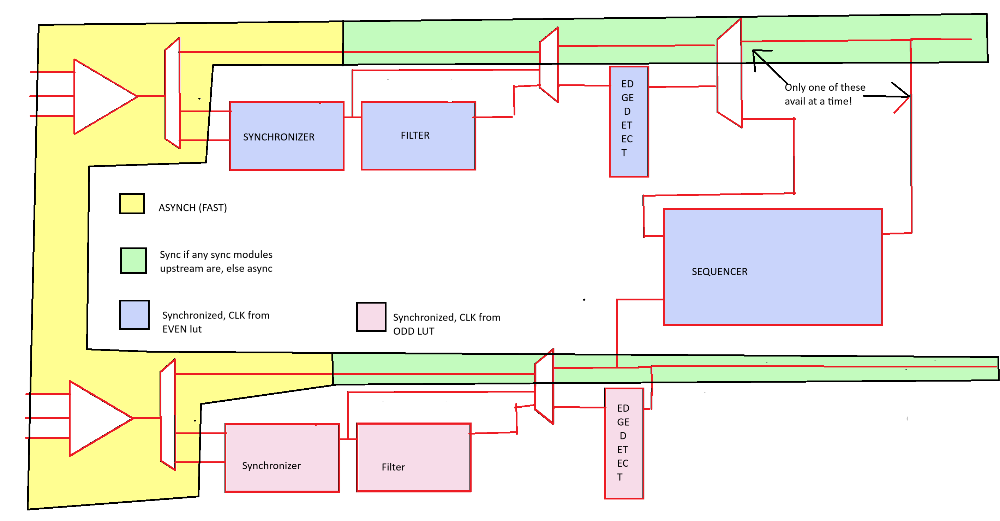
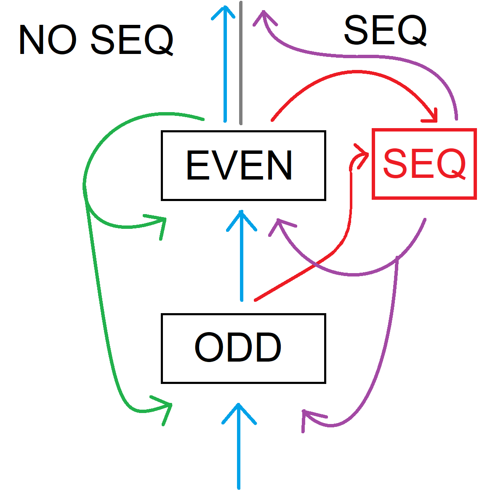

# CCL Toolbox

There are some simple patterns that you can use with the CCL/Logic library to generate very widly applicable effects
* [Reordering inputs](Tricks_and_Tips.md#reordering-inputs)
* [Examples](Tricks_and_Tips.md#axamples)
* [Feedback](Tricks_and_Tips.md#Feedback)
  * [But I need feedback on an ODD LUT](Tricks_and_Tips.md#but-I-need-feedback-on-an-odd-lut)
* [Speaking of response time, how fast is it?](Tricks_and_Tips.md#speaking-of-response-time-how-fast-is-it)
* [A bit more on clocks and timing](Tricks_and_Tips.md#a-bit-more-on-clocks-and-timing)
  * [Ugly graphic depicting above](Tricks_and_Tips.md#ugly-graphic-depicting-above)
  * [The edge detector](Tricks_and_Tips.md#the-edge-detector)
  * [The ~programmable delay~ synchronizer/filter](Tricks_and_Tips.md#the-~programmable-delay~-synchronizerfilter)
  * [The sequencer](Tricks_and_Tips.md#the-sequencer)
  * [The signal proceeds through a logic block's subcomponents in an order](Tricks_and_Tips.md#the-signal-proceeds-through-a-logic-blocks-subcomponents-in-an-order)
* [PWM is magic](Tricks_and_Tips.md#pwm-is-magic)
  * [Long-armed PWM](Tricks_and_Tips.md#long-armed-pwm)
  * [Out-of-phase PWM](Tricks_and_Tips.md#out-of-phase-pwm)
  * [Modulated PWM](Tricks_and_Tips.md#modulated-pwm)
* [Sequential logic with just one LUT](Tricks_and_Tips.md#sequential-logic-with-just-one-lut)
  * [S-R latch](Tricks_and_Tips.md#s-r-latch)
  * [D-Type latch](Tricks_and_Tips.md#D-type-latch)
  * [Pulse-stretcher](Tricks_and_Tips.md#pulse-stretcher)
    * [Even LUT](Tricks_and_Tips.md#aven-lut)
    * [Odd LUT](Tricks_and_Tips.md#odd-lut)
  * [Pulse Stretcher 2](Tricks_and_Tips.md#pulse-stretcher-2)
    * [Even LUT](Tricks_and_Tips.md#aven-lut)
    * [Odd LUT](Tricks_and_Tips.md#odd-lut)
* [More patterns](Tricks_and_Tips.md#more-patterns)
  * [A/B select](Tricks_and_Tips.md#ab-select)
  * [Gated Buffer](Tricks_and_Tips.md#Gated-buffer)
  * [Buffer (0 clock delay), 2 clock delay or 4 clock delay for level events](Tricks_and_Tips.md#buffer-0-clock-delay,-2-clock-delay-or-4-clock-delay-for-level-events)
  * [2 LUT edge detector for RISING *or* FALLING](Tricks_and_Tips.md#2-lut-edge-detector-for-rising-or-falling)
    * [LUTn+1: Configure for 2 or 4 clock delay as above](Tricks_and_Tips.md#lutn1-configure-for-2-or-4-clock-delay-as-above)
    * [LUTn](Tricks_and_Tips.md#lutn)
    * [Variant: Lightning fast pulses](Tricks_and_Tips.md#Variant--lightning-fast-pulses)
    * [Review - what determines what](Tricks_and_Tips.md#review---what-determines-what)
* [Prescaling clocks with the CCL](Tricks_and_Tips.md#prescaling-clocks-with-the-ccl)
  * [The general scheme](Tricks_and_Tips.md#the-general-scheme)
* [Appendix I: The giant table of clock division via CCL](Tricks_and_Tips.md#appendix-I-the-giant-table-of-clock-division-via-ccl)
  * [An alternate approach to generating clock signals](Tricks_and_Tips.md#an-alternate-approach-to-generating-clock-signals)
## Reordering inputs
**MOST OF THIS DISCUSSION (reordering) NEGLECTS THE MSB AND LSB, as the reordering behavior only effects the non-extremal values.**

There are four variations on each of these with different behavior when all inputs are the same, as the behavior with all 1's or all 0's is independent of what order they are in.
These are not relevant to reordering. Reordering is confusing enough as is (and it really shouldn't be, but our brains aren't wired well for this I don't think)

To get identical behavior:

* TRUTH = 0bHGFEDCBA when IN0 is α, IN1 is β and IN2 is γ
* TRUTH = 0bHDFBGCEA when IN0 is γ, IN1 is β and IN2 is α - D and G, B and E swap
* TRUTH = 0bHFGEDBCA when IN0 is α, IN1 is γ and IN2 is β - G and F, B and C swap
* TRUTH = 0bHGDCFEBA when IN0 is γ, IN1 is α and IN2 is β - F and D, E and C swap
* TRUTH = 0bHDGCFBEA when IN0 is β, IN1 is α and IN2 is γ - F→D→G→F rotate, and B→C→E→B rotate.
* TRUTH = 0bHFDBGECA when IN0 is β, IN1 is γ and IN2 is α - F→G→D→F rotate, and B→E→C→B rotate.

the highest and lowest bits do not change when reordering the inputs.

Note also that not all truthtables have six distinct permutations that can be made by reordering the inputs. Ignoring the MSB and LSB, which are unchanged by input swapping - each of these thus has 4 variants with each possible permutation of those bits), of the 64 possible permutations:

4 do not change no matter how you switch around the inputs (assuming we've bitwise and'ed truth with 0b01111110 and have not shifted it in any way):

These are cases that treat all inputs equally (the logic formulas are hideous or trivial to write out)

| TRUTH & 0x7E | Bits set | Rationalization
|--------------|----------|---------------------
| 0x00         |      0/6 | LOW always, except potentially when all three inputs are HIGH or all three inputs are LOW.
| 0x16         |      3/6 | HIGH if exactly one input is HIGH
| 0x68         |      3/6 | HIGH if exactly two inputs are HIGH
| 0x7E         |      6/6 | HIGH in all cases except (potentially) when all three inputs are HIGH or all three inputs are LOW.

A significant number of options come in sets of threes; these indicate:
1. All of these have a logical formula of `( α [and|or] (β [opp] γ))`
* `[opp]` is any binary logical operator where the order of the arguments doesn't matter; essentially all of them
  * "Don't care" is an option, too.
  * So the two 3/6 bit-set sets (A, and !A) fit the above 1 same 2 different pattern: 1 significant input, and two that are treated the same: they're disregarded.
* It's worth noting that even whacky behavior - eg `A and !(B or C) or (!A and (B or C))` does conform to this.


| TRUTH & 0x7E     | Bits set | Rationalization                                                                                               | Logic
|------------------|----------|---------------------------------------------------------------------------------------------------------------|---------------
| 0x02, 0x04, 0x10 |      1/6 | HIGH if one specified input HIGH and all others LOW.                                                          |  A and !(B or  C)
| 0x08, 0x20, 0x40 |      1/6 | HIGH IF a specific input is LOW  and all others HIGH.                                                         | !A and  (B and C)
| 0x06, 0x12, 0x14 |      2/6 | HIGH IF one (not both) of two specified inputs is high, and the third is low.                                 | !A and  (B xor C)
| 0x28, 0x48, 0x60 |      2/6 | HIGH IF specified input HIGH and one of the others HIGH A and                                                 |         (B  or C)
| 0x18, 0x24, 0x42 |      2/6 | HIGH IF specified input HIGH and both others LOW, or specified input LOW and both others HIGH.                | (A and !(B  or C)) or (!A and  B and C)
| 0x0E, 0x32, 0x54 |      3/6 | HIGH if specified input LOW.                                                                                  |        (!A), DNC B/C
| 0x2A, 0x4C, 0x70 |      3/6 | HIGH if specified input HIGH.                                                                                 |         (A), DNC B/C
| 0x1E, 0x36, 0x56 |      4/6 | HIGH IF either a specific input is HIGH and the others low, or either of the others are high.                 | (A and !(B  or C)) or (!A and (B  or C))
| 0x6A, 0x6C, 0x78 |      4/6 | HIGH if specified input, or both other inputs HIGH.                                                          |  A  or  (B and C)
| 0x6E, 0x7A, 0x7C |      5/6 | HIGH UNLESS one specified input HIGH and others LOW.                                                          | !A  or  (B  or C)
| 0x3E, 0x5E, 0x76 |      5/6 | HIGH UNLESS one specified input LOW and others HIGH.                                                          |  A  or !(B and C)

24 possibilities there, so we have gotten to 4 + 24 = 28 so far.

|                   TRUTH & 0x7E     | Bits set | Rationalization
|------------------------------------|----------|--------------------------
| 0x0A, 0x0C, 0x22, 0x30, 0x44, 0x50 |      2/6 | If one specified input HIGH and other specified input LOW, without specifying the last one. | (A  and !B) DNC C
| 0x1A, 0x1C, 0x26, 0x34, 0x46, 0x52 |      3/6 | If specified input HIGH and other specified input LOW, or first input LOW and second HIGH   | (A  and B) or (B xor C)
| 0x2C, 0x38, 0x4A, 0x58, 0x62, 0x64 |      3/6 | Opposite of the second                                                                      | (A and (B or C)) or (B and !C)
| 0x2E, 0x3A, 0x4E, 0x5C, 0x72, 0x74 |      4/6 | Opposite of first                                                                           | A or (B and !C)

In these cases, we have three distinct types of pins


Each of the preceding 64 "middles" corresponds to 4 different truth tables. So 3E, 5E and 76

### Other simple transforms
(Convention of A being in 0, C being in 2)
TRUTH = 0bJKLMNOPQ
Change  | Truth change |
--------|--------------|
A → !A | 0bKJMLONQP   |
B → !B | 0bLMJKPQNO   |
C → !C | 0bNOPQJKLM   |

```c++

//A -> !A
uint8_t newtruth = ((oldtruth & 0x55) << 1) | ((oldtruth & 0xAA) >> 1);

//B -> !B
uint8_t newtruth = ((oldtruth & 0x33) << 2) | ((oldtruth & 0xCC) >> 2);

//C -> !C
uint8_t newtruth = ((oldtruth & 0x0F) << 4) | ((oldtruth & 0xF0) >> 4);
// Now this, if the compiler implements it, could end up looking hideous. There's actually a single instruction swap-nybble instruction, which is exposed by _swap()
uint8_t newtruth = oldtruth;
_swap(nettruth);
//(this will not work correctly on 16-byte or 32-byte values; but arguably "swap the two nybbles" of a datatype with 4 or more of them is a malformed statement of intent)

```

### Brief comments on the high and low bit
I will mention that it is *markedly harder than makes sense* to find patterns in these. 256 is enough that the quantity is too much to keep straight without structure, and doing it while not looking at the two most "relevant" bits of a typical truth table doesn't make it as much easier as I'd hoped. It's a lot harder to see the structure without the low and high bits (though that also drives home how important those bits are when you try to rationalize a given truth table, and convert it into a flow-chart or logic diagram or verbal description.)

One interesting thing is that


## Examples

In the below examples X, Y, Z and 2 are used to refer to inputs. X, Y, and Z can refer to any input, but for the purposes of the LUT presented, X = 0, Y = 1, Z = 2

Input 2, since it can be used as a clock, may be specifically required.

## Feedback
The "Feedback" channel is the **output of the sequencer if used, and the even LUT in that pair if not. It is NEVER the output of the ODD LUT!**,

### But I need feedback on an ODD LUT
"Ya can't get there from here".

Well, you can, but it'll cost you. The price is one event channel: Use the output as a generator, and set one of the event inputs of the CCL block to that channel - note that the response time of the two is not identical (can be seen easily with the free-running oscillator)

## Speaking of response time, how fast is it?
Faster than a bat out of hell, as long as the whole path is async (otherwise, you're limited by the 2-3 clock cycle delay introduced by the synchronizer)
* All Async:
  * 1 LUT with one input (feedbsck) and truthtable 0x01 will freerun at ~83 MHz on a 2-series -> 6-6.25ns prop delay
  * 1 LUT with one input (event channel) and truthtable 0x01 will freerun at ~48 MHz  -> around 10.5ns prop delay,
  * 2 LUTs (ODD lut takes feedback (which always comes from the even LUT) and outputs unchanged, EVEN lut takes link input and inverts) will freerun at ~41 MHz. notable in that 2 stages have exactly twice the propagation time, perfect.
  * 4 LUTs (all set to 1 input, link, hence going in a loop. One of them set to invert output, all others to output input). Will freerun around 20 MHz. 4 stages = 4x the propagation time, how cool is that?
  * Thus, if LUTs have a propagation time of 6.25ns, event channels may be more like 4.25 ns. This, ah, this is fast.
  * All of above speeds are variable depending on environmental conditions, such as temperature and voltage. As with the internal oscillator
* If a user of the output isn't async, add 2-3 clocks for each time synchronization has to occur, and note that TCB's async mode may not do what it's supposed to. Whenever I've poked a stick in the direction of some obscure async fact, it just stirs up a lot of mud. I did, after many dead ends, manage to manifest a difference in behavior (other than higher noise sensitivity) from pins 2 and 6 vs other pins. a. the behavior is never relevant in practice because the reti takes longer than a synchronization delay to return anyway. I could manifest it by turning interrupts off, setting the pin to interrupt on low level, with the pin tied to ground. Then I'd clear the interrupt and read the intflags, then clear the interrupt, noop, read the intflags; 2 noop
  * In fully async mode, since 80 MHz is 160 transitions per microsecond, we see a propagation delay of just over 6 nanoseconds (on 2-series) per "stage" implying that it will have the time to propagate 3-4 stages in one system clock
  * When the synchronizer or filter is used, an extra 2-3 clocks are needed. 2 clocks is much more likely t
* Voltage dependence? Yes, yes there is.

Propagation time (Tp) is in ns, and has been rounded to quarter-nanoseconds to drive home the limited accuracy to which we can calculate it. The freerunning oscillator isn't and should be considered approximate, as the small sample size (n = 1) is clearly not sufficient to judge if these specs are even representative, much less could be specified in general to that level of precision. With the values these take, I maintain that this is an appropriate approach.

Current was also measured using a bench power supply. As the power supply in quetion is known to be of low quality (typical low cost chinese import bench supply). It was deemed sufficiently accurate for this purpose, though its readings were sometimes not reproducible, leading to uncertainty about whether the discrepancy was within the microcontroller or elsewheremember, this is a sample size of 1 tested under conditions governed by expediency, not precision. I did, however, set the cpu speed to 1 MHz to reach lower voltages and to make the control numbers more useful


| Vdd   | F(case1) | F(case2) | Tp CCL   | Tp EVSYS | I (case1) | I (case2) | I(control) |Notes
|-------|----------|----------|----------|----------|-----------|-----------|------------|----
| 5.2   | 84.x MHz | 49 MHz   |  6.0     |  4.25    |    n/t    |    n/t    |     n/t    | (VUSB, current unmetered)
| 5.0   | 83.x MHz | 48 MHz   |  6.0     |  4.50    |     17 mA |      6 mA |       0    | .
| 4.5   | 78 MHz   | 44 MHz   |  6.5     |  5.0     |     12 mA |      6    |       0    | .
| 4.0   | 71 MHz   | 40 MHz   |  7.0     |  5.5     |    7.5 mA |      6    |       0    | .
| 3.5   | 63 MHz   | 36 MHz   |  8.0     |  6.0     |      6 mA |      6    |       0    | .
| 3.3   | 59 MHz   | 34 MHz   |  8.5     |  6.25    |      6 mA |      5    |       0    | .
| 3.3   | 59 MHz   |  n/t     |  8.5     |  n/t     |     n/t   |     n/t   |      n/t   | (From 3.3v regulator (LDL1117), current unmetered)
| 3.0   | 53 MHz   | 30.5 MHz |  9.5     |  7.0     |      6 mA |      3    |       0    | .
| 2.5   | 42 MHz   | 24.1 MHz | 12.0     |  8.75    |      4 mA |      0    |       0    | At 20 Mhz, 2.4V no longer works.Raising voltage again does not fix it, power cycle needed. That is not surprising
| 2.0   | 29 MHz   | 16.6 MHz | 17.25    |  13.0    |      0 mA |      0    |       0    | Current readings obviously of
| 1.9   | 26.0 MHz | 15.0 MHz | 19.25    |  14.0    |      0 mA |      0    |       0    | little value below here. But
| 1.8   | 23.4 MHz | 13.4 MHz | 21.5     |  16.0    |      0 mA |      0    |       0    | This is the minimum rated voltage for these parts, and the lowest BOD voltage
| 1.7   | 20.5 MHz | 11.8 MHz | 24.5     |  18.0    |      0 mA |      0    |       0    | .
| 1.6   | 17.8 MHz | 10.1 MHz | 28.0     |  21.5    |      0 mA |      0    |       0    | .
| 1.5   | 15.1 MHz |  8.6 MHz | 33.0     |  25.0    |      0 mA |      0    |       0    | .
| 1.4   | 12.3 MHz |  7.1 MHz | 40.75    |  29.75   |      0 mA |      0    |       0    | At least the CCL kept at it down to 1.4v, before hitting the power on reset threshold at 1.3V
| 1.3   | 0 MHz    | 0 MHz    | n/a      | n/a      |      0 mA |      0 mA |       0 mA | Chip below POR threshold


Conclusions:
* Vdd has expected effect on CCL propagation delays on tinyAVR 2-series
* Turning off all port input buffers had no effect on the CCL's performance. Negligible impact on current, but 1 mA is huge in powerdown.
* Why was current under control conditions (identical except CCL configured to not oscillate) in all cases nil? Seems IDD @ 1 MHz active mode is < 1.0 mA?
  * At 1 MHz clock, when I had both functions activated at the same time (logic 0 and event 0 doing one output and logic 2 independently freerunning) at 5v Idd was 24 MHz, more than the sum of it's parts.
  * No further current measurements are to be made via this device, as I do not have sufficient confidence in the accuracy of the tool to draw conclusions. It may just suck at measuring current at the low end of it's range
  * That I also recorded 6 mA with no load connected at one point supports the theory that these current numbers are of dubious value.
  * Further evidence comes from the non-repeatable measurements of current at 5.0v during case 1, which was read as 12mA and 17 mA, both measurements could be repeated and got the same value. I cannot reconcile how, despite no firmware upload having occurred in the interim and conditions being unchanged,
* Therefore, all current values reported above should be considered quantitatively meaningless, but the observed correlations are strong enough that we can still say some things about current.
  * The CCL power consumption can be significant when transitioning quickly. The speed of the transitions, and the voltage, seem to be the main determining factors. I suspect that the lower current seen with the eventsys involvedwas simply a case of low
  * The CCL power consumption is insignificantwhen not transitioning.
  * Excess power consumption is mostly dependent on the frequency of pin transitions.
  * Excess power consumption was observed by misconfiguring a CCL in an arguably pathological way, typical applications of the CCL use very little power.
* CCL propagation delay at 5V is around 6.0 ns. EVSYS 4.25 ns.
  * Only about 50% higher at 3.3V
  * Between 3.0 and 1.9V, the propagation delay doubles.
* Some general learnings about the parts:
  * At room temperatiure, this 3224 specimen didn't quit working at 20 MHz (was repeated at 1 to get cleaner numbers to lower voltages) until vdd was below 2.5V, which is 0.2v below the stated minimum voltage for 10 MHz. Of course, all the CPU had to do was execute repeated rjmp .-2 instructions, but this once again proves that these parts blow their specs out of the water at room temperatire
  * If voltage may droop and return without going to zero, USE BOD IF YOU WANT IT TO COME BACK CLEANLY FROM UNDERVOLTAGE EVENT!


## A bit more on clocks and timing
The clocks have some counterintuitive behavior. First off, what do they and do they not effect?
* The clocks are used only by:
  * The Filter or Synchronizer, if enabled.
  * The sequencer, if it is configured as a flip-flop.
  * The Edge Detector
* The clock is not used for:
  * The logic block itself

### Ugly graphic depicting above

### Annotated graphic from the datasheet re: feedback paths
Highlighted in color below. No part announced, much less shipped, has had an odd number of LUTs. They're unlikely to start now.

### The edge detector
Sometimes you need a pulse when all you have is a level. This gets you there. The clock is involved because the resulting pulse is 1 CCL clock long (occasionally this is not long enough, since the CCL clock can be faster than the system clock, particularly on the EB, where you can clock the CCL from the PLL, or you may be using a very slow clock, and it could be troublesome how long it is.

### The ~programmable delay~ synchronizer/filter
This is one of the really cool, repurposable features. The intended use is that you can use the synchronizer to take a 2 clock cycle delay to ensure clean transitions and prevent glitches, with the filter meant to provide a means of cleanly handling more substantial noise by requiring that the signal be unchanged for 4 CCL clocks before outputting it. One of these must be used for the edge detector to work.

I'd love to see longer delay option, (synchronize + delay with more stages and without filter I think would be the most fun...)

### The sequencer
The sequencer is an optional pathway that takes the two outputs of the pair of LUTs as the inputs to a latch or flip-flop. As flipflops are clocked, these use the EVEN LUTs clock It takes the clock from the EVEN LUT when acting as a flip-flop. Latches have no clock.

I have not tested how the RS latch behaves when both inputs are high (which is forbidden on an RS latch). My guess is that the state of output during that time is undefined admd could be high or low. , and when one of the inputs is deasserted, the other one will take effect


### The signal proceeds through a logic block's subcomponents in an order
It's important to understand the signal path.
1. The LUT - asynchronously monitors it's inputs and outputs a value based on the truth table.
2. The Filter/Synchronizer - Takes input from the LUT. Either does nothing, performs a 2 clock synchronization, or performs synchronization, then feeds that through 2 additional flipflops, and compares the output of the last one with the sync output, and only changes if the two match, indicating a signal stable for more than 2 clocks. This introduces a delay of 2 or 4 clocks
3. The edgedetector, if enabled, takes the output from the filter/synchronizer, and reacts to edges in that (note that per datasheet, you need to have one of those two enabled - unclear if that's "Or else" or "Because we put an interlock to prevent you from doing that"). That pulse starts as soon as the signal gets in, and lasts one clock.
4. Finally, if the sequencer is enabled, it overrides the output of the even LUT.
5. This signal - the sequencer if enabled / Even LUT's output if not - is what feeds both the pin (if enabled) and the signal that is provided as feedback (if used).

Thus - the LUT comes first. It's output then may or may not be filtered/synchronized and if it is, may be edge-detected. If we imagine a LUT taking say, the OR of 2 inputs, and put a filter on it, and each of those inputs is (for simplicity) changing according to the same clock as the LUT. If the two inputs are, repeating: HLL and LHL, the output from the first stage will be HHL. The filter will then turn that into *a continuous high level*.


## PWM is magic
Unlike the event channels, where you get a single clock long pulse from a compare match or overflow, the inputs to logic blocks are the level of the output compare! That means that you can remap pins that don't exist on your part (but which would have PWM if they did) to the LUT output pin.

### Long-armed PWM
Reach out and use a timer on a distant pin instead of the (non-existent) one it would normally output on

INSEL:
```text
X: TCA WO0, TCB0 or TCD WOA
Y: masked
Z: masked
or
X: masked
Y: TCA WO1, TCB1 or TCD WOB
Z: masked
or
X: masked
Y: masked
Z: TCA WO2, TCB2 or TCD WOC (which is WOA)
```

LUT - Only one input is used, so there will be 2 bits that matter and 6 that don't (and should be left 0 by convention). One of them is 0 - typically the LSB for non-inverted PWM, the other is a 1:
* 0x02 (0b00000010) for input 0
* 0x04 (0b00000100) for input 1
* 0x10 (0b00010000) for input 2

Clock: N/A

Sync/Filter: Off

Output: Enabled

Note that TCA WO3-5, TCB3+, and TCD WOD are not available as inputs.

Of particular utility when:
* Using low-pincount parts with peripherals squabbling over special function pins
  * Of particular use on tinyAVRs in 14-pin packages, pin-starved AVRxxDD14 or AVRxxDU14.
    * The tinyAVR, low-half of PORTB (which is the only part of PORTB on a 14-pin part is a high-contention block of pins, PB2 and PB3 are used for serial, WO2 and WO0 from TCA0, and the crystal. TCA0 WO0 and WO1 are on PB0 and PB1, as is the TWI.
    * PWM output on 14-pin Dx-series parts is pretty craptacular. You get to pick *one of*: PWM on PA0/PA1, PWM on PC1, 2, and 3 (or just PC3 for the DU), or PWM on PD4 and PD5. 14-pin EB's, in contrast,
* On a 20-pin part upon which you must use a crystal for some godawful reason, thus taking up pin 0 and 1, and you want all 6 PWMs from TCA0, LUT0 and LUT1 can give output on PA6 and PC3 on their alternate and default pin respectively.
  * Since on these parts, you also can't use either of the TCBs to generate PWM (the timers having, respectively, zero and one pin present, and the one pin is PA3, used by another PWM channel). LUT2 can output on PD6 (and TCD0 outputting on PD4 and PD5) and LUT3 has to go to an event channel and come out on PA6.
  * Thus, with a HF crystal for the clock, you can still get PWM on PA2, PA3, PA4, PA5, PA6 (via LUT0), PA7 (via LUT3 and EVSYS), PC3 (via LUT1), PD4 (TCD), PD5 (TCD), PD6 (via LUT2) = 10 pins, leaving only 3 non-power, non-programming pins - PC1, PC2 (which you'll probably use as a UART) and PD7 (can do PD6 instead at the cost of an event channel).
* On a DA, or DB with the TCD PORTMUX erratum (most extant specimens), especially on low pincount parts where there's a lot of stuff with only it's default mux option.
* When you attempt to find the pattern in the TCB and TCA1 PORTMUX options (there isn't one) and lose the ability to think rationally about pin assignment.
  * Maybe it's contagious... look at the pinouts on classic AVRs.

### Out-of-phase PWM
Problem: You have 3 output channels, each of which requires PWM at a different duty cycle (total not exceeding 100%), but they control large loads, and your power supply can only power one at a time.

If you use a TCA (remembering to call the takeover function), you can run it in in SINGLE mode, getting 16 bits of resolution.

If you then used it normally, the three duty cycles would be written to CMP0, CMP1, and CMP2, but they would all turn on at once, that's not okay. Instead, you could set them as:
* CMP0 = DC0 - 1 -> Output on the pin by setting pin output and writing 1 to the CMP0 bit
* CMP1 = DC0 + DC1 -1 -> Output through the CCL
* CMP2 = PER - DC2 -> Output on the pin by setting pin output, setting INVEN (inverting the pin), writing 1 to the CMP2 bit.

CMP0 < CMP1 - Ensured by above, provided that:

DS0 + DS1 <= PER - the duty cycles of the first two pins must not exceed 100%

To meet the specific specification (one at a time only) we would need to be sure that DS0 + DS1 + DS2 <= PER, but not all applications require that of the final duty cycle (maybe there are only two big loads, and one light load... (possibly a cooling fan on the power supply?)

INSEL:
* X: WO0
* Y: WO1
* Z: masked

LUT:
* 000: 0 - During the time before CMP0 is reached, the second big load shouldn't be on.
* 001: 1 - Now CMP0 has been reached but CMP1 hasn't, so here is where we want the to turn this output, controlling the second load.
* 010: 0 - This is never reachable in practice if CMP1 > CMP0.
* 011: 0 - Once CMP1 and CMP0 have been passed, we turn off WO

Clock: N/A

Sync/Filter: Off

Yes, we could have done the third one with another CCL lut too - but why when there's a trick to do it without wasting a second LUT? Maybe we need the other LUTs.

### Modulated PWM
Like classic AVRs had on larger pincount devices. One PWM frequency should be significantly higher than the other if you're trying to modulate it, rather than measure the beat frequency or something, and they definitely should be at different frequencies, otherwise see the previous pattern.

INSEL:
* X: Timer PWM channel.
* Y: Second PWM channel.
* Z: masked

LUT: 0x08 (0b00001000, HIGH if both inputs are high)

Clock: N/A

Sync/Filter: Off

## Sequential logic with just one LUT
You can simulate some sequential logic units with just one LUT!

Enable the synchronizer to get the analogous flip-flop.

### S-R latch

INSEL:
* X: Clear (any input source)
* Y: Set (any input source)
* Z: Feedback

LUT:
* 000: 0   - feedback is 0 and neither control asserted -> does nothing
* 001: 0   - feedback is 0 and clear asserted -> does nothing
* 010: 1   - feedback is 0 and set asserted. -> 1
* 011: -   - Per app requirements. Currently a 0, forbidden state with both lines asserted.
* 100: 1   - feedback is 1 and neither control asserted -> does nothing
* 101: 0   - feedback is 1 but clear asserted -> 0
* 110: 1   - feedback is 1. set asserted, does nothing. -> does nothing
* 111: -   - Per app requirements. Currently a 1, forbidden state with both lines asserted.
Ergo: TRUTH = 0x0b?101?100 = 0x54, 0x5C, 0xD4 or 0xDC

It's clear that 0x5C is no good, unless you want it to oscillate at a very high rate when both control signals are high; you probably don't want that. The remaining ones have a simple relationship to each other

0x54 will always go low in event of both controls being high, 0xDC will always go high, and 0xD4 will not change the output until one of the input signals is removed. Which one makes sense depends on your application and the kind of signals you can get access to easily.

Clock: N/A for latch, anything except IN2 as clock as demanded by application for flipflop.

Sync/Filter: Off for latch, on for flip-flop.

### D-Type latch

INSEL:
* X: Feedback
* Y: D (gated signal to latch)
* Z: G (Gate)

LUT:
* 000: 0
* 001: 1
* 010: 0
* 011: 1
* 100: 0
* 101: 0
* 110: 1
* 111: 1
Ergo: TRUTH = 0xCB (corresponding to the 1...1 subtype of 0x4A above)

Unlike the RS case, there is only one coherent

Clock: N/A for latch, anything except IN2 as clock as demanded by application for flipflop.

Sync/Filter: Off for latch, on for flip-flop.


### Pulse-stretcher
You often need pulses output on pins or to direct internal peripherals via the event system. Maybe you have an input that generates fast pulses, but you need a long enough pulse for a synchronous peripheral to react to, or maybe you'd like to generate a pulse from software, and then immediately write to another pin *during* the pulse, because that would make some bigbanged mess cleaner (I doubt it will, but feel free to try).

#### Even LUT
Start with the even LUT set to act as an S/R latch as described above.

INSEL:
* Set: Pulse input
* Reset: Link
* Feedback

LUT per above.

#### Odd LUT
The odd lut is a simple delay.

INSEL:
X: Feedback (from Even LUT)
Y: Masked
Z: Clock or Masked

LUT: 0x02

Clock: Anything that 2 or 4 ticks of will be a long enough pulse.

Sync/Filter: Sync to stretch any pulse on the input to 2 CLK<sub>odd</sub>, filter for 4 CLK<sub>odd</sub>.

Edge detector: No

This combination does the following:
1. Input signal sets the LUT acting as an SR latch. This generates the undelayed pulse output.
2. Delay LUT has the sync/filter on, and possibly a slower clock source than the system clock, and sync or filter is on, so this slows the signal down.
3. 2 or 4 clocks later, the output of the second LUT goes high. This resets the LUT as SR latch, and also gives you a delayed pulse you may need.
4. 2 or 4 clocks after that, reset goes low and and the mechanism is ready for the next pulse
5. You might be tempted to use an edge detector on the delay LUT for faster recovery time. This is not safe. If an incoming pulse beats your recovery time, you can end up with a wedged mechanism that can't be readily unwedged; consider this sequence of events:
  a. Input pulse sets SR latch, starting pulse output
  b. delay lut delays, and then generates a pulse
  c. Another input pulse arrives during the stretched pulse - starting either before or during that reset pulse, but ending after the reset pulse ends.
  e. There are three ways to handle the contradictory inputs. None of them work. If you set output low, the output will go low, but as soon as it goes away, set is still high, so the output is set once more. But the the brief low output could be missed by the synchronizer. This in turn would mean no reset pulse. If we set high on both, it's guaranteed not reset any time this happens. And maintaining the previous level just mirrors one of those. No matter what, there's a chance you won't get any more reset pulses whenever your recovery time is missed.
6. Without an edge detector, it depends on what behavior you want, specifically how you want to deal with a signal that occurs during your recovery time.

| On cont. inputs go | Throughout reset | During and after | Before and during |
|--------------------|------------------|------------------|-------------------|
| Low                | Pulse ends on <br/> time, one pulse length<br/>after end, 2nd pulse |  Pulse ends on <br/> time, one pulse length<br/>after end, 2nd pulse | Second pulse ignored. |
| High               | Pulse extra long <br/>, No second pulse | Pulse ends on <br/>time, second pulse <br/> starts immediately | First pulse lasts until<br/>second input ends |
| Maintain           | As high, above. | As low, above | As high, above. |


### Pulse Stretcher 2
This uses the sequencer. It doesn't get you the delayed pulse. However, it is largely free of complications.

#### Even LUT
Even LUT drives set.

INSEL:
* X: Pulse input
* Y: Link (they say you can't have S and R high on the SR latch (and we don't get to pick behavior there like we did. ))
* Masked

LUT 0x02

#### Odd LUT
The odd lut drives reset, much like the one above did.

INSEL:
X: Feedback (from Sequencer)
Y: Masked
Z: Clock or Masked

LUT: 0x02

Clock: Anything that 2 or 4 ticks of will be a long enough pulse

Sync/Filter: Sync to stretch any pulse on the input to 2 CLK<sub>odd</sub>, filter for 4 CLK<sub>odd</sub>

Sequencer: S/R latch


## More patterns

### A/B select
Allows selection of one of two inputs as it's output based on the remaining input. Obviously, chainable if you have to.

INSEL:
* X: Selector
* Y: A - output when selector low
* Z: B - output when selector high

LUT:
* 000: 0
* 001: 0
* 010: 1
* 011: 0
* 100: 0
* 101: 1
* 110: 1
* 111: 1

Ergo: TRUTH = 0xE4

### Gated Buffer
Let a signal through or output a constant signal depending on the second signal.
INSEL:
* X: D - When G is high, D is output
* Y: G - When G is low, the output is low.
* Z: masked

LUT:
* 000: 0
* 001: 0
* 010: 0
* 011: 1
Ergo: TRUTH = 0x08

Clock: N/A

Sync/Filter: Off


### Buffer (0 clock delay), 2 clock delay or 4 clock delay for level events
Without the synchronizer or prescaler, this is just a buffer (which is far from useless, recall the part above regarding PWM pins
With the synchronizer or prescaler, it inserts a delay of 2 or 4 clocks into a level transition.

INSEL:
* X: Input
* Y: Masked
* Z: Masked or used for clock source. Input signals are delayed 0, 2 or 4 of these clocks.

LUT:
* 000: 0
* 001: 1

TRUTH = 0x02

Clock: Whichever clock source will give you the delay that you need. This is CLK<sub>odd</sub>.

Sync/Filter: Off - 0 clock delay (buffer), Sync (2 clock delay) or Filter (4 clock delay, plus filtering).

Note that with sync/filter off, the delay is not zero, obviously, but the response time is significantly faster than the system clock. Not only that, but these two methods of setting up the buffer will give slightly different times:

1. Pin input -> Event channel -> CCL -> Pin output
2. Pin input -> CCL -> Pin output
3. CCL -> CCL -> CCL -> Pin output
4. CCL -> Event channel -> CCL -> Pin output
5. CCL output -> CCL -> Pin output
6. CCL -> Event channel -> CCL -> CCL -> Pin output.

In the second case, the idea was to exclude everything except the propagation time of the signal in the chip. It will oscillate, allowing a scope to be used to measure the frequency (hence the meaningful measure, the propagation delay). Note that bandwidth limiting needs to be off - scopes often are designed to attenuate signals above 20 MHz, and this is typically turned on by default. You usually want it on because it reduces the visibility of any high frequency noise that might be obscuring the signal, but not if you're looking at a signal in that range.

### 2 LUT edge detector for RISING *or* FALLING
This generates a pulse two or four clocks long on either a rising *or* falling edge.

We need 2 LUTs, n, and n+1, where n is an even number.

#### LUTn+1: Configure for 2 or 4 clock delay as above
See also variant below. The first stage is just generating a delayed version of the input waveform.

#### LUTn
Then we take the input, and xor it with the delayed input, and output that.
INSEL:
* X: Input
* Y: LINK
* Z: Masked

LUT:
* 000: 0
* 001: 1
* 010: 1
* 011: 0
TRUTH = 0x06

Clock: N/A (typically)

Sync/Filter: (typically - can be used to delay the pulse slightly)

#### Variant: Lightning fast pulses
Using an input that is available through both the event system and directly (say, LUT0's PA1 input, which LUT0 can use directly, but LUT1 would need to get it through the event channel, and turn off sync/filter. The event channel (I believe) adds 1 propagation delay to the input on LUT1, which immediately switches it's output and that arrives at LUT0 through link 1 propagation time later) This adds a delay of 1 propagation time, and the CCL itself adds another. In this configuration like that you would get pulses of 20-25 ns duration whenever the input transitioned. Is this of much use? Doubtful - but it's useful to consider this limiting case.

#### Review - what determines what
There are two parameters needed to describe the behavior of this configuration - the delay between the rising edge of the input and the rising edge of the output is 1 propagation time (negligible almost all of the time), unless the filter or synchronizer of the EVEN lut is enabled, in which case that delay will be 2 or 4 CLK<sub>even</sub>. The length of the pulse is determined by CLK<sub>odd</sub> if the sync or filter are enabled - since the output is high when the inputs are different, a delay in the first stage manifests as the length of the pulse, and thus is 2 or 4 CLK<sub>odd</sub>. If the synchronizer or filter on the EVEN lut are used to delay the start of the pulse, F_CLK<sub>even</sub> must be >= F_CLK<sub>odd</sub> to avoid misbehavior, however, it may be as fast as you like within the limits of the hardware.

**Tip:** The AVR EB-series is coming with a very powerful PLL (for an AVR! But it seriously does: 8x or 16x multiply, 1, 2, 4 or 6 input divider, then an optional 2:1 divider on the output, and somewhere there's a prescaler B that divides something by 4 if you want. I don't know what and won't until we get the datasheet). And guess what - You can clock the CCL with it! So that's something to look forward to on the EB! For some of us, possibly the only thing, but let's not dwell on the negative.

## Prescaling clocks with the CCL

You can use CCL logic blocks to prescale a clock, albeit inefficiently. On parts with 6 LUTs, you can prescale by 2^18 if you're willing to use all LUTs and 3 event channels. This can be used for example to clock a TCB from a prescaled value that is slower than half the system clock but not used by any TCA.

Generally, I would argue that if you're using more than 3 LUTs, you should consider whether there is any other way to achieve your goal.

**Tip:** This will be way more powerful on the EB, for the reasons described in the tip at the end of the previous section.

### The general scheme

1. Find the prescaling factor you want on the table below.
2. Check the LUTS and EVENTS columns and make sure you have that many available.
  a. An additional event channel will be needed if you want to "skip" the more useful even lut in a pair\
  b. If ALL luts are used, and the chip is not impacted by errata about the link input on LUT3, AND you don't need the output on an event channel, you can save a channel. You can also save a channel if only using 2 LUTs.
3. Select a block of the necessary number of consecutive LUTs,
  a. The lowest LUT should be even.
4. Configure the LUTs:
  a. The highest number LUT should be set to use the output of the lowest number LUT, either through feedback (if only 2 luts used), link (if all luts are used for this) or otherwise an event channel set to use the lowest number LUT as generator.
  b. If the number under the column with the LUT number heading (0-5) is a 4, the "filter/synchronizer" should be set as synchronizer.
  c. If the number is an 8, it should be set as a filter.
  d. The highest number LUT should use the system clock (or other clock to be prescaled.
  e. If the operation is ADD set input 0 that lut to link, and the truth table to 0x02. (output a 1 when input is 1)
  f. If the operation in MUL set input 0 to be feedback (if even) or an event channel carrying it's own output (if odd), and input 2 to link (unless it's the highest lut).
  g. If the operation is ADDn, ADDnMULn+1, or MULn - Uh, I forget what exactly these translated into.
  h. The highest LUT, and any luts multiplying the previous one, should get a truth table of 0x01 (output a 1 when input is 0).
  i. Take the table with a spoonful of salt.  I found several errors in a short time looking at it.

## Appendix I: The giant table of clock division via CCL

| Total | p0 | 0 | 1 | oppr 0    | oppr 1    | p2+3 | p2 | 2 | 3 | oppr 2    | oppr 3    | p3 | 4 | 5 | op4 | LUTS | Events | Warning |
|-------|----|---|---|-----------|-----------|------|----|---|---|-----------|-----------|----|---|---|-----|------|--------|---------|
|     4 |  4 | 4 | - |     FIRST |         - |    - |  - | - | - |         - |         - |  - | - | - |   - |    2 |      0 |         |
|     8 |  8 | 4 | - |     FIRST |         - |    - |  - | - | - |         - |         - |  - | - | - |   - |    2 |      0 |         |
|    12 | 12 | 4 | 8 |       ADD |     FIRST |    - |  - | - | - |         - |         - |  - | - | - |   - |    2 |      0 |         |
|    16 | 16 | 8 | 8 |       ADD |     FIRST |    - |  - | - | - |         - |         - |  - | - | - |   - |    2 |      0 |         |
|    20 | 16 | 8 | 8 |       ADD |       ADD |    - |  4 | 4 | - |     FIRST |         - |  - | - | - |   - |    3 |      1 | No 0/1s |
|    24 | 16 | 4 | 4 |      ADD2 |       ADD |    - |  8 | 8 | - |     FIRST |         - |  - | - | - |   - |    3 |      1 | No 0/1s |
|    28 | 16 | 8 | 8 |       ADD |       ADD |    - | 12 | 8 | 4 |       ADD |     FIRST |  - | - | - |   - |    4 |      0 | No 0/1s |
|    32 | 32 | 4 | 8 |       MUL |     FIRST |    - |  - | - | - |         - |         - |  - | - | - |   - |    2 |      0 |         |
|    36 |  4 | - | 4 |        -  |       ADD |    - | 32 | 8 | 4 |       MUL |     FIRST |  - | - | - |   - |    3 |      1 | No 0/1s |
|    40 |  8 | - | 8 |        -  |       ADD |    - | 32 | 8 | 4 |       MUL |     FIRST |  - | - | - |   - |    3 |      1 | No 0/1s |
|    44 | 12 | 4 | 8 |       ADD |       ADD |    - | 32 | 8 | 4 |       MUL |     FIRST |  - | - | - |   - |    4 |      2 | No 0/1s |
|    48 | 16 | 8 | 8 |       ADD |       ADD |    - | 32 | 8 | 4 |       MUL |     FIRST |  - | - | - |   - |    4 |      1 | No 0/1s |
|    52 | 32 | 4 | 8 |       MUL |       ADD |    - | 16 | 4 | 4 |       MUL |      ADD4 |  4 | 4 | - | FST |    5 |      1 | Dx ONLY |
|    64 | 64 | 8 | 8 |       MUL |     FIRST |    - |  - | - | - |         - |         - |  - | - | - |   - |    2 |      0 |         |
|    68 |  4 | - | 4 |        -  |       ADD |    - | 64 | 8 | 8 |       MUL |     FIRST |  - | - | - |   - |    3 |      1 | No 0/1s |
|    72 |  4 | - | 8 |        -  |       ADD |    - | 64 | 8 | 8 |       MUL |     FIRST |  - | - | - |   - |    3 |      1 | No 0/1s |
|    76 |  4 | 4 | 8 |       ADD |       ADD |    - | 64 | 8 | 8 |       MUL |     FIRST |  - | - | - |   - |    4 |      1 | No 0/1s |
|    80 |  4 | 8 | 8 |       ADD |       ADD |    - | 64 | 8 | 8 |       MUL |     FIRST |  - | - | - |   - |    4 |      1 | No 0/1s |
|    84 | 64 | 8 | 8 |       MUL |       ADD |    - | 16 | 8 | 8 |       ADD |      ADD4 |  4 | 4 | - | FST |    5 |      1 | Dx ONLY |
|    88 |  8 | 4 | 4 |       ADD |  ADD2MUL3 |    - |  * | 4 | 4 |       ADD |  ADD4MUL5 |  * | 4 | 4 |   - |    6 |      1 | Dx ONLY |
|    96 |  8 | 4 | 4 |       ADD |       ADD |    - | 12 | 4 | 8 |       ADD |      MUL4 |  4 | 4 | - |   - |    5 |      1 | Dx ONLY |
|   100 | 64 | 8 | 8 |       MUL |       ADD |    - | 32 | 4 | 8 |       MUL |      ADD4 |  4 | 4 | - |   - |    5 |      1 | Dx ONLY |
|   108 | 12 | 4 | 8 |       ADD |  ADD2MUL3 |    - |  * | 4 | 8 |       ADD |  ADD4MUL5 |  * | 4 | 4 | ADD |    6 |      1 | Dx ONLY |
|   128 | 16 | 4 | 4 |      MUL2 |       MUL |    - |  8 | 8 | - |     FIRST |         - |  - | - | - |   - |    3 |      1 | No 0/1s |
|   140 | 12 | 4 | 8 |       ADD |       ADD |  128 | 16 | 8 | 8 |       ADD |       MUL |  8 | 4 | 4 | ADD |    6 |      0 | Dx ONLY |
|   144 | 12 | 4 | 8 |       ADD |       MUL |    - | 12 | 4 | 8 |       ADD |     FIRST |  - | - | - |   - |    4 |      1 | No 0/1s |
|   152 |  8 | 4 | 4 |       ADD |  ADD2MUL3 |    - |  * | 4 | 4 |       ADD |  ADD4MUL5 |  * | 4 | 8 |   - |    6 |      1 | Dx ONLY |
|   160 |  8 | 4 | 4 |       ADD |       MUL |    - | 12 | 4 | 8 |       ADD |      ADD4 |  4 | 8 | - |   - |    5 |      1 | Dx ONLY |
|   172 | 12 | 4 | 8 |       ADD |  ADD2MUL3 |    - |  - | 4 | 8 |       ADD |  ADD4MUL5 |  * | 4 | 8 |   - |    6 |      1 | Dx ONLY |
|   192 | 16 | 8 | 8 |       ADD |       MUL |    - | 12 | 4 | 8 |       ADD |     FIRST |  - | - | - |   - |    4 |      1 | No 0/1s |
|   204 | 12 | 4 | 8 |       ADD |       ADD |  192 | 16 | 8 | 8 |       ADD |       MUL | 12 | 4 | 8 | ADD |    6 |      0 | Dx ONLY |
|   208 | 16 | 8 | 8 |       ADD |  ADD2MUL3 |    - |  * | 8 | 8 |       ADD |  ADD4MUL5 |  * | 4 | 4 |   - |    6 |      1 | Dx ONLY |
|   224 | 32 | 4 | 8 |       MUL |       ADD |  192 | 16 | 8 | 8 |       ADD |       MUL | 12 | 4 | 8 | ADD |    6 |      0 | Dx ONLY |
|   256 | 16 | 4 | 4 |       MUL |       MUL |    - | 16 | 4 | 4 |       MUL |     FIRST |  - | - | - |   - |    4 |      1 | No 0/1s |
|   268 | 12 | 4 | 8 |       ADD |       ADD |  256 | 16 | 8 | 8 |       ADD |       MUL | 16 | 8 | 8 | ADD |    6 |      0 | Dx ONLY |
|   288 | 12 | 4 | 8 |       ADD |       MUL |    - | 16 | 8 | 8 |       ADD |      ADD4 |  8 | 8 | - |   - |    5 |      1 | Dx ONLY |
|   300 | 12 | 4 | 8 |       ADD |  ADD2MUL3 |    - |  * | 4 | 8 |       ADD |  ADD4MUL5 |  * | 8 | 8 |   - |    6 |      2 | Dx ONLY |
|   336 | 16 | 8 | 8 |       ADD |  ADD2MUL3 |    - |  * | 8 | 8 |       ADD |  ADD4MUL5 |  * | 4 | 8 |   - |    6 |      2 | Dx ONLY |
|   384 | 16 | 8 | 8 |       ADD |       MUL |    - | 16 | 4 | 4 |       MUL |      ADD4 |  8 | 8 | - |   - |    5 |      1 | Dx ONLY |
|   512 | 64 | 8 | 8 |       MUL |       ADD |    - | 16 | 8 | 8 |       ADD |      MUL4 |  4 | 4 | - |   - |    5 |      1 | Dx ONLY |
|   576 | 12 | 4 | 8 |       ADD |       MUL |   48 | 32 | 4 | 8 |       MUL |       ADD | 16 | 4 | 4 | MUL |    6 |      2 | Dx ONLY |
|   592 | 16 | 8 | 8 |       ADD |  ADD2MUL3 |    - |  * | 8 | 8 |       ADD |  ADD4MUL5 |  * | 8 | 8 |   - |    6 |      1 | Dx ONLY |
|   640 | 16 | 4 | 4 |       MUL |       MUL |    - | 32 | 4 | 8 |       MUL |      ADD4 |  8 | 8 | - |   - |    5 |      2 | Dx ONLY |
|   768 | 12 | 4 | 8 |       ADD |       MUL |   64 | 32 | 4 | 8 |       MUL |       ADD | 32 | 4 | 8 | MUL |    6 |      2 | Dx ONLY |
|  1024 | 32 | 4 | 8 |       MUL |       MUL |    - | 32 | 4 | 8 |       MUL |     FIRST |  - | - | - |   - |    4 |      2 | No 0/1s |
|  1088 | 16 | 4 | 4 |      MUL2 |       MUL |    - | 68 | 8 | 8 |       MUL |  ADD4MUL5 |  * | 8 | 4 | MUL |    5 |      3 | Dx ONLY |
|  1152 | 12 | 4 | 8 |       ADD |       MUL |    - | 16 | 8 | 8 |       ADD |      MUL4 |  8 | 8 | - |   - |    5 |      1 | Dx ONLY |
|  1280 | 16 | 4 | 4 |       MUL |       MUL |   80 | 16 | 4 | 4 |       MUL |       ADD | 64 | 8 | 8 | MUL |    6 |      2 | Dx ONLY |
|  1536 | 16 | 8 | 8 |       ADD |       MUL |    - | 16 | 4 | 4 |       MUL |      MUL4 |  8 | 8 | - |   - |    5 |      2 | Dx ONLY |
|  2048 | 16 | 4 | 4 |       MUL |       MUL |    - | 32 | 4 | 8 |       MUL |      MUL4 |  8 | 8 | - |   - |    5 |      2 | Dx ONLY |
|  2304 | 32 | 4 | 8 |       MUL |       MUL |    - | 64 | 8 | 8 |       MUL |      ADD4 |  8 | 8 | - |   - |    5 |      2 | Dx ONLY |
|  4096 | 64 | 8 | 8 |       MUL |       MUL |    - | 64 | 8 | 8 |       MUL |     FIRST |  - | - | - |   - |    4 |      2 | No 0/1s |
|  4608 | 64 | 8 | 8 |       MUL |       MUL |    - | 64 | 8 | 8 |       MUL |      ADD4 | 12 | 8 | 4 | ADD |    5 |      2 | Dx ONLY |
|  8192 | 32 | 4 | 8 |       MUL |       MUL |    - | 64 | 8 | 8 |       MUL |      MUL4 |  8 | 8 | - |   - |    5 |      2 | Dx ONLY |
| 16384 | 16 | 8 | 8 |       ADD |       MUL | 1024 | 32 | 4 | 8 |       MUL |       MUL | 32 | 4 | 8 | MUL |    6 |      2 | Dx ONLY |
| 24576 | 12 | 4 | 8 |       ADD |       MUL | 2048 | 32 | 4 | 8 |       MUL |       MUL | 64 | 8 | 8 | MUL |    6 |      2 | Dx ONLY |
| 32768 | 64 | 8 | 8 |       MUL |       MUL |    - | 64 | 8 | 8 |       MUL |      MUL4 |  8 | 8 | - |   - |    5 |      2 | Dx ONLY |
| 65536 | 16 | 8 | 8 |       ADD |       MUL | 4096 | 64 | 8 | 8 |       MUL |       MUL | 64 | 8 | 8 | MUL |    6 |      3 | Dx ONLY |
|131072 | 64 | 8 | 8 |       MUL |       MUL | 2048 | 32 | 4 | 8 |       MUL |       MUL | 64 | 8 | 8 | MUL |    6 |      3 | Dx ONLY |
|262144 | 64 | 8 | 8 |       MUL |       MUL | 4096 | 64 | 8 | 8 |       MUL |       MUL | 64 | 8 | 8 | MUL |    6 |      3 | Dx ONLY |

`*` - This column is cannot express a value for the two combined pair of LUTs LUTs in the case where one of them is added to the lower LUTs, and the whole thing multiplied by the other.

`Dx ONLY` indicates that this is only possible on an AVR DA or DB-series part, because it requires 6 LUTs, and no other parts have yet had that.
`No 0/1s` indicates that this is not possible on the tinyAVR 0-series or tinyAVR 1-series. It is possible on the megaAVR 0-series, tinyAVR 2-series, and all Dx-series and Ex-series parts.

### An alternate approach to generating clock signals
1. Sacrifice the XCK pin of an unneeded USART. You must set the pin output.
2. Configure that USART for synchronous mode, at a baud rate equal to the desired frequency.
3. Use the event system USART generator.
4. You now have a programmable clock source. Remember to read the [Serial](../../extras/Ref_Serial.md) documentation on async mode, as it is a niche feature, it was decided to avoid compromising performance parameters of the popular UART for the less common USRT mode.

This exploits the fact that the XCK output is always active - though the fractional baud rate generation is not enabled, allowing speeds of `F_CPU/(2 * BAUD[15:6])` `BAUD[15:6]` refers to the 10 high bits of BAUD (the lower ones cannot be used and must be written zero in synchronous mode. )
